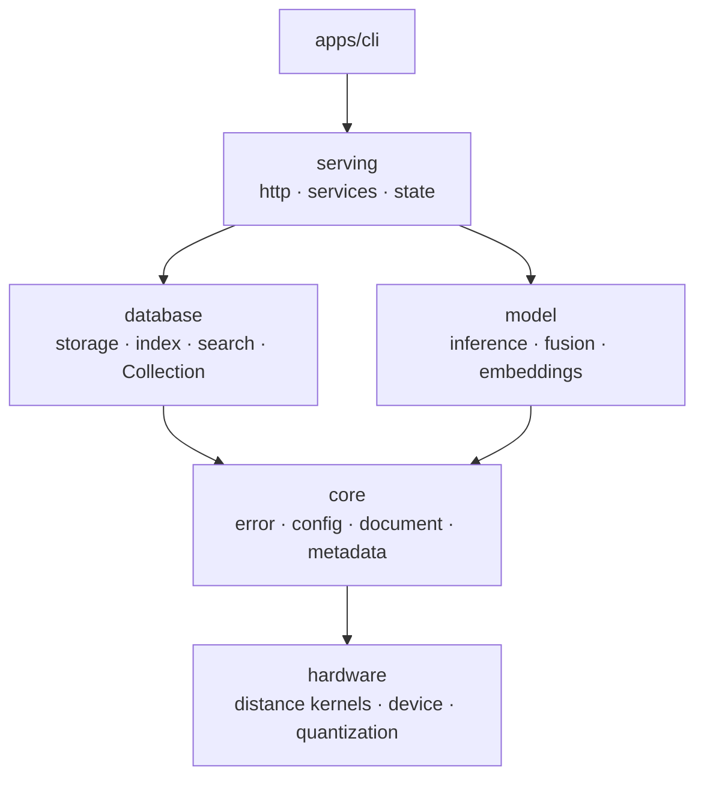

<p align="center">
    <b>Inference Engine for Retrieval Systems</b>
</p>

<p align="center">
    <a href="https://crates.io/crates/piramid"></a>
    <a href="LICENSE"></a>
</p>

<p align="center">
  <a href="#what-this-is">What this is</a> •
  <a href="#quickstart">Quickstart</a> •
  <a href="#usage">Usage</a> •
  <a href="#where-this-is-going">Where this is going</a> •
  <a href="docs/ARCHITECTURE.md">Architecture</a> •
  <a href="docs/SETUP.md">Setup</a> •
  <a href="docs/ROADMAP.md">Roadmap</a>
</p>

## What this is

Piramid is an inference engine for RAG where one process holding the documents, the model weights and
the KV cache on one device, so retrieval can run *during* generation rather than once before it.

https://github.com/user-attachments/assets/487cbc0f-c279-4a15-a160-9acd4666fbe6

### How it's put together


Five library crates under `apps/engine`, plus the binary that links them. A crate may depend on
one below it; the reverse fails CI.



`hardware` depends on nothing else, so kernels can be benchmarked on their own and `model` can get
a device without reaching through retrieval math. `model` depends on nothing in `database`, which
is what keeps a collection queryable with no model loaded.

Built on Rust 1.87 with `axum` and `tokio` for the server, `serde` for the wire and disk formats,
`wide` for SIMD kernels that lower to AVX2 and NEON, `memmap2` for zero-copy record reads,
`dashmap` and `parking_lot` for the concurrent paths, and `tracing` with OTLP for telemetry. The
`gpu-cuda` and `inference-candle` features are reserved for CUDA and model execution and are still
empty, so a default build needs neither a CUDA toolkit nor a model runtime. The full list and the
reasoning is in [docs/ARCHITECTURE.md](docs/ARCHITECTURE.md#what-its-built-on).

Full guide in [docs/ARCHITECTURE.md](docs/ARCHITECTURE.md). Decisions and their reasoning in
[docs/decisions/](docs/decisions/).

## Quickstart

```bash
cargo install piramid
piramid serve --data-dir ./data
```

Listens on `127.0.0.1:6333`. Data goes to `~/.piramid` unless `startup.data_dir` says otherwise. Every
setting is listed in [`.env.example`](.env.example).

Or with Docker:

```bash
docker run -p 6333:6333 -v piramid-data:/data -e PIRAMID_API_KEY="$(openssl rand -hex 32)" \
  ghcr.io/ashworks1706/piramid:main
```

A server bound to anything other than loopback refuses to start without an API key. Set
`PIRAMID_API_KEY` and send it as `Authorization: Bearer <key>` on every request except
`/api/health` and `/api/readyz`, or set `startup.http.auth.allow_unauthenticated: true` to serve
without one. Each client gets a token bucket of 100 requests per second with a burst of 200,
tuned under `startup.http.rate_limit`. SIGINT or SIGTERM drains in-flight requests for up to 30
seconds, checkpoints every open collection, and exits.

`piramid` with no subcommand opens the console, described below. `piramid serve` runs the server
in the foreground and `piramid support-bundle` writes diagnostics for a bug report.

## Usage

```bash
# With PIRAMID_API_KEY set, add -H "Authorization: Bearer $PIRAMID_API_KEY" to each request.

# Create a collection
curl -X POST http://localhost:6333/api/collections \
  -H "Content-Type: application/json" \
  -d '{"name": "docs"}'

# Store vectors. Every write and query takes lists, one document per position.
curl -X POST http://localhost:6333/api/collections/docs/vectors \
  -H "Content-Type: application/json" \
  -d '{"vectors": [[0.1, 0.2, 0.3, 0.4]], "texts": ["Hello world"],
       "metadata": [{"category": "greeting"}]}'

# Embed and store text (needs startup.embedding set)
curl -X POST http://localhost:6333/api/collections/docs/embed \
  -H "Content-Type: application/json" \
  -d '{"texts": ["hello", "bonjour"], "metadata": [{"lang": "en"}, {"lang": "fr"}]}'

# Search. One result list comes back per query vector, in request order.
curl -X POST http://localhost:6333/api/collections/docs/search \
  -H "Content-Type: application/json" \
  -d '{"vectors": [[0.1, 0.2, 0.3, 0.4]], "k": 5}'

# Search with a metadata filter: {"field": {"op": value}},
# where op is eq, ne, gt, gte, lt, lte, or in.
curl -X POST http://localhost:6333/api/collections/docs/search \
  -H "Content-Type: application/json" \
  -d '{"vectors": [[0.1, 0.2, 0.3, 0.4]], "k": 5,
       "filter": {"category": {"eq": "greeting"}}}'
```

Operational endpoints: `/api/health`, `/api/readyz`, `/api/version`, `/api/metrics` for the JSON
view and `/metrics` for Prometheus.

### The console

```bash
piramid
```

With no subcommand, `piramid` opens a terminal UI over the server: every collection on disk,
whether it is open, its index and tuning, memory, search and lock latency as a running sparkline,
WAL size and checkpoint age, and the configuration as the server resolved it. Digits switch view,
`r` rebuilds a collection index and `c` compacts it after a `y`/`n`, and `?` lists the keys.

```
 piramid  NORMAL  1 collections  2 config  v0.2.0  * server * ready
+-- collections 2 ---------------++-- docs Flat 12,430 vectors ----------------+
| * docs                 12,430  ||  index                                     |
| o notes                   902  ||  type              hnsw                    |
|                                ||  ef_search         64                      |
|                                ||  memory            41.2 MB                 |
|                                ||                                            |
|                                ||  latency                                   |
|                                ||  search            0.31 ms                 |
|                                ||  lock read         0.01 ms                 |
|                                ||                                            |
|                                ||  durability                                |
|                                ||  last checkpoint   5s ago                  |
+--------------------------------++--------------------------------------------+
 j/k move  r rebuild index  c compact  R refresh  ? help  q quit
```

Run inside a checkout it gains a third view, `units`, which drives every recipe in the justfile
and the compose services. An installed binary has no justfile to drive, so that view is hidden.

It reads the same configuration file the server does, under `console:`. There is nothing to set for
the common case: `console.base_url` is empty by default and follows the address `startup.bind`
names, so a server moved to another port is watched without saying so twice.

Two things run without a terminal, because they have to: `piramid serve` is what the container
runs, and `piramid support-bundle` collects diagnostics on a host where you cannot drive a UI.

## Where this is going

Knowledge does not have to live in a model's weights, and it does not have to live in the prompt
either. Retrieval that reaches the model directly costs no context window, and it can happen
during generation rather than once before it.

Retrieval inside a generation — repeated, overlapped with compute, against state that never leaves
the device — is what the single process is for. Retrieval before prefill costs one service hop and
does not need one.

Piramid commits to the seam for that rather than to a particular mechanism.
`model::fusion::RetrievalHook` says when retrieval may happen and what it may touch, not how
retrieved data gets combined. Chunked cross-attention, residual-stream gating, and learned index
routing would all be implementations of the same trait. The trait exists before anything calls it
because a forward-pass driver written without the seam is hard to retrofit with one.

### How it gets measured

Retrieval before prefill is the control arm: a colocated, warm split stack. Four configurations run
against it on the same corpus at the same token budget — split process, in-process CPU index,
in-process device-resident index, and retrieval overlapped with prefill on its own stream.
Reported: TTFT, tokens/sec, p50/p95, recall.

The result gets published whichever way it goes.

[docs/ROADMAP.md](docs/ROADMAP.md) has the plan, as a todo list.

## Working on Piramid

Contributor tooling is separate from the shipped binary. `just` drives the repo — building,
testing, linting, running the site — and is never needed to *use* Piramid. `piramid` is the binary
users install, and it has no idea `just` exists.

```bash
just bootstrap   # .env, git hooks, dependencies
just cli         # the console, with the units view a checkout unlocks
just doctor      # check your tooling
just check       # the gate: fmt, clippy, tests, layering
just serve       # run the server from source
just web         # the site on :3000
```

`just cli` is the one to reach for. It runs `piramid` with no subcommand, which opens the same
console users get, plus a `units` view over the whole repo: the server, the website, the compose
services, and every recipe in the justfile, each with its output streaming into a pane beside it.
Nothing here is reimplemented. Starting the server runs `just serve`, exactly what you would type,
so it cannot drift from the justfile.

```
 piramid  NORMAL  ● server ● ready ○ web  started serve
╭ units ─────────────────────────╮╭ serve · running · 12s · 11 lines · follow ──────────────╮
│ apps                           ││23:05:09 $ setsid just serve                             │
│  ● serve                  :6333││23:05:09 cargo run -p piramid -- serve                   │
│  ○ web                    :3000││23:05:10      Running `target/debug/piramid serve`        │
│  ○ web-preview            :3000││23:05:10  INFO piramid::config: server_starting          │
│ containers                     ││23:05:13  INFO piramid::http: http_request …             │
│  ○ piramid                :6333││                                                         │
│  ○ ollama                :11434││                                                         │
│ tasks                          ││                                                         │
│  ✓ doctor                      ││                                                         │
│  ○ check                       ││                                                         │
╰────────────────────────────────╯╰──────────────── the engine and its HTTP surface ────────╯
 j/k move ⏎ start/stop r restart l/h logs/units / search : command o open url ? help q quit
```

`:` takes any recipe the sidebar does not list, so `:check-gpu`, `:web-preview` or
`:bench --save-baseline main` runs as a task of its own. Quitting stops the host processes it started — `setsid` means the whole
tree goes, not just `just` — and leaves containers up.

[AGENTS.md](AGENTS.md) covers the layout, the dependency rule, and the conventions.
[docs/SETUP.md](docs/SETUP.md) has the full list.

## License

[Apache 2.0](LICENSE)
