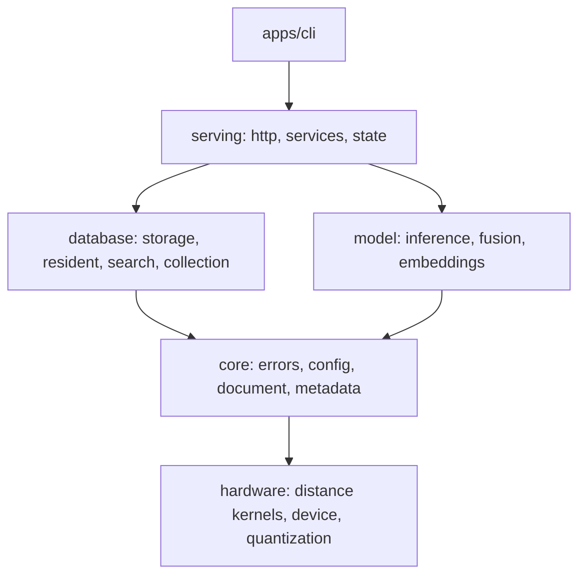

<p align="center">
    <b>An inference engine for RAG, in Rust</b>
</p>

<p align="center">
    <a href="https://crates.io/crates/piramid"></a>
    <a href="LICENSE"></a>
</p>

<p align="center">
  <a href="#what-this-is">What this is</a> •
  <a href="#quickstart">Quickstart</a> •
  <a href="#the-console">Console</a> •
  <a href="#where-this-is-going">Where this is going</a> •
  <a href="docs/ARCHITECTURE.md">Architecture</a> •
  <a href="docs/SETUP.md">Setup</a> •
  <a href="docs/ROADMAP.md">Roadmap</a>
</p>

## What this is

Piramid is an inference engine for RAG (retrieval-augmented generation: answering a question with
a language model after looking up relevant documents). It runs on one GPU, or on the CPU, as a
single process that holds three things together: the documents, the model weights, and the KV
cache (the attention state the model keeps for every sequence it is generating).

You use it through `piramid serve`. The server loads a model, keeps collections of documents on
disk, and answers questions over HTTP. A request to `/api/generate` can name a collection: the
server embeds the question, searches the collection, places the best passages in the prompt, and
generates the answer, all in the same process. The same model is also served through an
OpenAI-compatible `/v1/chat/completions` endpoint.

Today retrieval runs once, before the model reads the prompt. Keeping everything in one process is
what will let retrieval run during generation instead; see
[Where this is going](#where-this-is-going).

https://github.com/user-attachments/assets/487cbc0f-c279-4a15-a160-9acd4666fbe6

## Quickstart

The steps below build Piramid, load a small Qwen2.5 model on a GPU, store a few documents, and
ask a question that uses them. [docs/SETUP.md](docs/SETUP.md) covers each step in more detail.

### 1. Build with the model features

Model execution is behind two Cargo features. `inference-candle` runs the model, and `gpu-cuda`
runs it, and search, on a CUDA device. Both are off by default, so a plain build serves
collections and search but cannot load a model.

```bash
# GPU build: needs a CUDA toolkit
cargo install --git https://github.com/ashworks1706/piramid piramid --locked \
  --features inference-candle,gpu-cuda

# CPU build
cargo install --git https://github.com/ashworks1706/piramid piramid --locked \
  --features inference-candle
```

### 2. Download a model

Piramid runs Qwen2 and Qwen3 checkpoints, which includes Qwen2.5. The model directory must hold
`config.json`, `tokenizer.json`, `tokenizer_config.json` and the `.safetensors` weights, which is
how these checkpoints are published on Hugging Face:

```bash
hf download Qwen/Qwen2.5-0.5B-Instruct --local-dir ./models/Qwen2.5-0.5B-Instruct
```

### 3. Write a configuration

Save this as `piramid.yaml`. It turns on inference and names an embedding provider, which is what
turns text into vectors for storing and searching.

```yaml
startup:
  hardware:
    profile: gpu              # open the CUDA device at startup
  embedding:
    provider: openai
    model: text-embedding-3-small

runtime:
  execution: gpu              # score search on the device; the gpu profile requires it
  inference:
    enabled: true
    model_path: ./models/Qwen2.5-0.5B-Instruct
```

The model loads onto `cuda:0` under the `gpu` profile. On a CPU build, leave out `profile` and
`execution`, and give the KV cache a budget in bytes, which the CPU requires:

```yaml
runtime:
  inference:
    enabled: true
    model_path: ./models/Qwen2.5-0.5B-Instruct
    kv_cache:
      max_bytes: 2147483648
```

The `openai` provider reads its key from `OPENAI_API_KEY`, and also works with any server that
speaks the same format (TEI, vLLM, llama.cpp) when `base_url` points at it. There are two other
providers. Either block replaces the `embedding` block above:

```yaml
# An Ollama server on this machine
startup:
  embedding:
    provider: ollama
    model: nomic-embed-text
```

```yaml
# A Qwen3 embedding checkpoint run inside Piramid
startup:
  embedding:
    provider: piramid
    model: ./models/Qwen3-Embedding-0.6B
    options:
      device: cuda:0          # or cpu
```

[`config.example.yaml`](config.example.yaml) lists every setting with its default.

### 4. Start the server

```bash
export OPENAI_API_KEY=...
piramid serve --config piramid.yaml
```

The server listens on `127.0.0.1:6333` and stores collections under `./data`. `--port` and
`--data-dir` change those. Check that the model loaded:

```bash
curl http://localhost:6333/api/model
```

### 5. Put documents into a collection

A collection is a named set of documents. Each document has an id, an embedding, its text, and
optional metadata. `/embed` embeds each text with the configured provider and stores it, creating
the collection if it does not exist yet. Lists are positional: the first metadata object belongs to
the first text.

```bash
curl -X POST http://localhost:6333/api/collections/docs/embed \
  -H "Content-Type: application/json" \
  -d '{"texts": [
         "Piramid writes every change to a write-ahead log before applying it.",
         "Compaction rewrites the record store without deleted documents."
       ],
       "metadata": [{"topic": "durability"}, {"topic": "storage"}]}'
```

A new collection takes its similarity metric from `runtime.search.metric` (cosine by default) and
keeps it for its whole life.

### 6. Ask a question with retrieval

```bash
curl -X POST http://localhost:6333/api/generate \
  -H "Content-Type: application/json" \
  -d '{"messages": [{"role": "user", "content": "What happens to deleted documents?"}],
       "retrieval": {"collection": "docs", "k": 2},
       "max_new_tokens": 128}'
```

The server embeds the last user message, finds the `k` closest documents, adds them to the system
message, and generates. The response holds the answer in `text`, token counts and timings in
`usage`, and the passages it used in `retrieval`:

```json
{
  "text": "Compaction removes them ...",
  "finish_reason": "stop",
  "usage": {"prompt_tokens": 71, "cached_prompt_tokens": 0, "completion_tokens": 24,
            "time_to_first_token_ms": 18.2, "total_ms": 160.4},
  "retrieval": {"collection": "docs",
                "passages": [{"id": "...", "score": 0.71, "text": "Compaction rewrites ..."}],
                "embed_ms": 95.1, "search_ms": 0.2}
}
```

A request can give `prompt` instead of `messages` to send raw text without the chat template, and
`"stream": true` to receive server-sent events: a `retrieval` event when the request retrieves, a
`token` event per token, and a final `done` event, or an `error` event if generation fails.

### 7. Use an OpenAI client

`/v1/chat/completions` and `/v1/models` follow the OpenAI format, so existing clients work with the
base URL changed. The model id is the name of the model directory unless
`runtime.inference.model_name` sets another.

```python
from openai import OpenAI

client = OpenAI(base_url="http://localhost:6333/v1", api_key="unused")
reply = client.chat.completions.create(
    model="Qwen2.5-0.5B-Instruct",
    messages=[{"role": "user", "content": "What happens to deleted documents?"}],
)
print(reply.choices[0].message.content)
```

This endpoint does not retrieve. Use `/api/generate` with `retrieval` when the answer should draw on
a collection. A request field Piramid does not support, such as `n` other than 1, is refused
rather than ignored.

### Searching a collection directly

Search does not need a model. It scores the query against every document in the collection, keeps
only documents whose metadata matches the filter, and returns the best `k`. A filter maps a
metadata field to an operator (`eq`, `ne`, `gt`, `gte`, `lt`, `lte` or `in`) and a value.

```bash
# Search by text, embedded with the configured provider
curl -X POST http://localhost:6333/api/collections/docs/search/text \
  -H "Content-Type: application/json" \
  -d '{"query": "crash safety", "k": 5, "filter": {"topic": {"eq": "durability"}}}'

# Store and search with vectors you computed yourself. One result list comes back per query.
curl -X POST http://localhost:6333/api/collections/notes/vectors \
  -H "Content-Type: application/json" \
  -d '{"vectors": [[0.1, 0.2, 0.3, 0.4]], "texts": ["Hello world"],
       "metadata": [{"category": "greeting"}]}'
curl -X POST http://localhost:6333/api/collections/notes/search \
  -H "Content-Type: application/json" \
  -d '{"vectors": [[0.1, 0.2, 0.3, 0.4]], "k": 5}'
```

Operational endpoints are `/api/health`, `/api/readyz`, `/api/version`, `/api/metrics` for JSON,
and `/metrics` for Prometheus.

### Serving on a network

The default bind, `127.0.0.1:6333`, serves without a key. A server bound to any other address
refuses to start unless `PIRAMID_API_KEY` is set, and then every request except `/api/health` and
`/api/readyz` must send `Authorization: Bearer <key>`. To serve an open port on purpose, set
`startup.http.auth.allow_unauthenticated: true`. Each client gets a token bucket of 100 requests per
second with a burst of 200, set under `startup.http.rate_limit`. On SIGINT or SIGTERM the server
drains in-flight requests for up to 30 seconds, checkpoints every open collection, and exits.

For containers, see [deploy/README.md](deploy/README.md).

### Reading more

[`config.example.yaml`](config.example.yaml) lists every setting with its default and what it does.
[docs/ARCHITECTURE.md](docs/ARCHITECTURE.md) explains how a search and a generation move through the
server, how the KV cache and the scheduler work, and what keeps a collection safe across a crash.
[docs/ROADMAP.md](docs/ROADMAP.md) says what is being built next and what is out of scope.

## The console

```bash
piramid
```

With no subcommand, `piramid` opens a terminal UI over a running server. Its views are selected
with digits. `collections` lists every collection on disk and, for an open one, its vector
dimension, memory, search and insert latency, lock wait, time since the last checkpoint and WAL
size, with search latency as a sparkline. `config` shows the configuration as the server resolved it. `device` graphs the host,
each GPU, the device memory budget, and generation on the loaded model. In `collections`, `c`
compacts the selected collection after a `y` or `n`, and `?` lists every key.

```
 piramid  NORMAL  1 collections  2 config  3 device  v0.2.0  * server * ready
+-- collections 2 ---------------++-- docs 12,430 documents -------------------+
| * docs                 12,430  ||  collection                                |
| o notes                   902  ||  dimension         768                     |
|                                ||  memory            41.2 MB                 |
|                                ||                                            |
|                                ||  latency                                   |
|                                ||  search            0.31 ms                 |
|                                ||  insert            0.08 ms                 |
|                                ||  lock read         0.01 ms                 |
|                                ||  lock write        0.02 ms                 |
|                                ||                                            |
|                                ||  durability                                |
|                                ||  last checkpoint   5s ago                  |
|                                ||  wal size          1.2 MB                  |
+--------------------------------++--------------------------------------------+
 j/k move  c compact  R refresh  ? help  q quit
```

The console reads its settings from the file `CONFIG_FILE` names, under `console:`.
`console.base_url` is empty by default and follows `startup.bind`, so it finds a server on a
changed port without a second setting. Run inside a checkout, it also shows a `units` view for contributors, described in
[Working on Piramid](#working-on-piramid).

`piramid support-bundle` writes diagnostics to attach to a bug report, for a host where you cannot
run a terminal UI.

## How it is built


Five library crates under `apps/engine`, plus the binary in `apps/cli` that links them. A crate may
depend on one below it in the diagram; the reverse fails CI.



`database` stores documents and searches them. Every document is kept in a record store on disk,
changes go through a write-ahead log first, and search is an exact scan over every stored vector,
on the CPU or the GPU. `model` runs the model: a paged KV cache, a batching scheduler, sampling, and
the embedding providers. `model` depends on nothing in `database`, so a collection can be searched
with no model loaded. `hardware` depends on nothing in the workspace, so distance kernels can be
benchmarked on their own.

It is written in Rust 1.87, with `axum` and `tokio` for the server, `candle` for model execution,
`cudarc` for the CUDA device, `wide` for SIMD distance kernels, `memmap2` for reading records from
disk, and `tracing` with OTLP for telemetry. A default build needs neither a CUDA toolkit nor a
model runtime. The full list is in
[docs/ARCHITECTURE.md](docs/ARCHITECTURE.md#what-it-is-built-on), and decisions with their reasons
are in [docs/decisions/](docs/decisions/).

## Where this is going

Knowledge does not have to live in a model's weights, and it does not have to live in the prompt
either. Retrieval that reaches the model directly costs no context window, and it can happen
during generation rather than once before it.

Retrieval before the model reads the prompt needs only one service call, so it does not need a
single process. Retrieval inside a generation does: it happens many times, runs alongside the
model's computation, and works against state that never leaves the device.

Piramid commits to the point where retrieval enters the model rather than to a particular way of
combining it. `model::fusion::RetrievalHook` says when retrieval may happen and what it may touch,
not how retrieved data gets combined. Chunked cross-attention, residual-stream gating and learned
routing would all be implementations of the same trait. The trait exists before anything calls it,
because a forward pass written without it would be hard to change later.

### How it gets measured

`just bench-rag` runs the end-to-end benchmark: for each question in a dataset it embeds, searches,
fetches passages, and generates, once per configuration, and writes the results as JSON. The
configurations are the question alone with no retrieval, retrieval from a separate Piramid server
over HTTP, retrieval from an in-process collection scored on the CPU, and the same scored on the
GPU. Each is reported with time to first token, decode tokens per second, p50 and p95 latency for
every stage, recall at `k`, and exact match against the dataset's answers.

Retrieval-before-prefill is the control. The arms still to come run retrieval on its own device
stream, overlapped with the model's computation. The result gets published whichever way it goes.
[docs/ROADMAP.md](docs/ROADMAP.md) has the plan.

## Working on Piramid

Contributor tooling is separate from the shipped binary. `just` drives the repo (building, testing,
linting, running the site) and is never needed to use Piramid. `piramid` is the binary users
install, and it knows nothing about `just`.

```bash
just bootstrap   # .env, git hooks, dependencies
just cli         # the console, with the units view a checkout adds
just doctor      # check your tooling
just check       # the gate: fmt, clippy, tests, layering, website
just serve       # run the server from source
just web         # the site on :3000
```

`just cli` runs `piramid` with no subcommand, which opens the same console users get, plus a `units`
view over the whole repo: the server, the website, the compose services, and every recipe in the
justfile, each with its output streaming into a pane beside it. Starting the server there runs
`just serve`, exactly what you would type, so it cannot drift from the justfile.

```
 piramid  NORMAL  ● server ● ready ○ web  started serve
╭ units ─────────────────────────╮╭ serve · running · 12s · 11 lines · follow ──────────────╮
│ apps                           ││23:05:09 $ setsid just serve                             │
│  ● serve                  :6333││23:05:09 cargo run -p piramid -- serve                   │
│  ○ web                    :3000││23:05:10      Running `target/debug/piramid serve`        │
│  ○ web-preview            :3000││23:05:10  INFO piramid::config: server_starting          │
│ containers                     ││23:05:13  INFO piramid::http: http_request …             │
│  ○ piramid                :6333││                                                         │
│  ○ ollama                :11434││                                                         │
│ tasks                          ││                                                         │
│  ✓ doctor                      ││                                                         │
│  ○ check                       ││                                                         │
╰────────────────────────────────╯╰──────────────── the engine and its HTTP surface ────────╯
 j/k move ⏎ start/stop r restart l/h logs/units / search : command o open url ? help q quit
```

`:` runs any recipe the sidebar does not list, so `:check-gpu` or `:bench --save-baseline main`
runs as a task of its own. Quitting stops the host processes it started, including their child
processes, and leaves containers running.

[AGENTS.md](AGENTS.md) covers the layout, the dependency rule and the conventions.
[docs/SETUP.md](docs/SETUP.md) has the full contributor setup, including testing and benchmarking
with a real model.

## License

[Apache 2.0](LICENSE)
