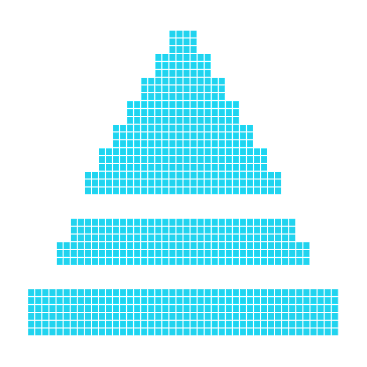

<p align="center">
    
</p>

<h1 align="center">Piramid</h1>

<p align="center"><b>inference runtime for retrieval systems</b></p>

Piramid is an inference engine for retrieval-augmented generation on one GPU, written in Rust. One
process holds the documents, the model weights and the KV cache, so retrieval can run during
generation instead of once before it. Today `piramid serve` embeds the question, runs an exact
search over a collection, puts the best passages in the prompt and generates, all in one process.

## Quickstart

```bash
# Build with model execution on CUDA (drop gpu-cuda for a CPU build)
cargo install --path apps/cli --locked --features inference-candle,gpu-cuda

hf download Qwen/Qwen2.5-0.5B-Instruct --local-dir ./models/Qwen2.5-0.5B-Instruct
```

`piramid.yaml`:

```yaml
startup:
  hardware:
    profile: gpu
  embedding:
    provider: openai
    model: text-embedding-3-small

runtime:
  execution: gpu
  inference:
    enabled: true
    model_path: ./models/Qwen2.5-0.5B-Instruct
```

```bash
export OPENAI_API_KEY=...
piramid serve --config piramid.yaml          # 127.0.0.1:6333

curl -X POST localhost:6333/api/collections/docs/embed -H 'Content-Type: application/json' \
  -d '{"texts": ["Compaction rewrites the record store without deleted documents."]}'

curl -X POST localhost:6333/api/generate -H 'Content-Type: application/json' \
  -d '{"messages": [{"role": "user", "content": "What happens to deleted documents?"}],
       "retrieval": {"collection": "docs", "k": 2}}'
```

## Docs

| | |
|---|---|
| [User docs](apps/website/content/docs/) | install, configuration, providers, HTTP API, console; served at [piramiddb.com/docs](https://piramiddb.com/docs) |
| [docs/ARCHITECTURE.md](docs/ARCHITECTURE.md) | crates, seams, request flows, KV cache, durability |
| [docs/ROADMAP.md](docs/ROADMAP.md) | direction, milestones, what is out of scope |
| [docs/SETUP.md](docs/SETUP.md) | contributor setup, tests, benchmarks, PR rules |
| [docs/decisions/](docs/decisions/) | why the shape is what it is |
| [deploy/README.md](deploy/README.md) | images and compose |
| [AGENTS.md](AGENTS.md) | layout, dependency rule, conventions |
| [config.example.yaml](config.example.yaml) | every setting at its default |

## Development

```bash
just bootstrap   # .env, git hooks, dependencies
just check       # the gate: fmt, clippy, tests, layering, website
just cli         # the console, plus a units view over the repo
```

## License

Proprietary. All rights reserved; see [LICENSE](LICENSE).
