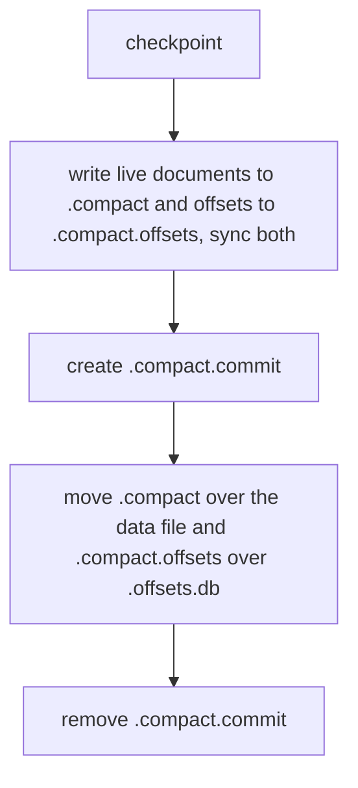

# piramid-database

The corpus a RAG request retrieves from: collections of documents, kept on disk, searched exactly.

A collection is a named set of documents. A document has an id, an embedding (a vector of floats),
its text, and metadata, which is a map of field names to values that a search can filter on. A
collection supports insert, upsert, get, list and delete, vector search with a metadata filter,
and compaction. It can be closed and opened again with every document intact.

## Storage

`storage` holds the bytes. One collection named `docs` is a data file, `docs.db`, and a set of
sidecar files beside it that share its name with a different suffix.

The data file is the record store: an append-only file of encoded documents, read through a memory
map when `runtime.memory.use_mmap` is on. A `RecordStore` knows nothing about collections; it
appends records and reads them back by position.

The sidecars hold what the record store does not. `.offsets.db` maps each live document id to the
position of its record. `.manifest.db` is the manifest: the collection name, timestamps, vector
width, document count, and the similarity metric the collection was created with. `.wal.db` is the
write-ahead log (WAL), and `.wal.meta` records the last log entry a checkpoint covered.
`SidecarManager` names every sidecar path, including the `.vecindex.db` index file Piramid 0.2
wrote, so collection delete and the scan for collections on disk find them all.

## Writes and durability

Every write is appended to the WAL before it changes anything else, then applied to the record
store and the in-memory state. A checkpoint syncs the data file, writes the manifest and offsets,
and only then clears the log. It runs after `runtime.wal.checkpoint_frequency` operations, at the
first write once `checkpoint_interval_secs` have passed, and on shutdown.

Opening a collection reads the manifest and offsets, loads the vector and metadata of every live
document into memory, replays the WAL entries written since the last checkpoint, and checkpoints if
it replayed any. A manifest with schema version 1 was written by Piramid 0.2; open refuses it with
an error naming the collection, which has to be ingested again.

## Resident state

`resident` holds what search reads, in memory, for every live document of an open collection:
the vectors in a `VectorStore` and the metadata in a `MetadataStore`. Both are filled when the
collection opens and kept current on every insert, upsert, metadata update and delete. Nothing in
them is evicted and they have no memory budget, so a filter never has to read a record from disk.

## Search

`search` is one exact scan. It scores the query against every stored vector with the distance
strategy `runtime.execution` selects, on the CPU or on a CUDA device, and keeps the best `k`
while applying the metadata filter in the same pass. A filtered search therefore returns `k` hits
whenever at least `k` documents match, even when the highest-scoring documents do not. A score
that is not a number never ranks.

The scan reads vectors through `VectorReader`. `as_slab` hands over every vector as one contiguous
block, which is the fast path and the shape a device takes in one copy; `gather_into` copies
selected rows when a reader has no such block. A batch of queries runs across worker threads when
`runtime.search.parallel` is on.

Every search uses the metric stored in the collection's manifest. A request that names a different
metric is refused.

## Compaction

Deleting a document removes its offset but leaves its record in the data file. Compaction reclaims
that space by writing every live document into a new data file.

The commit marker decides what happens after a crash. When open finds `.compact.commit`, it
finishes whichever moves are still to do and removes the marker. When it finds compacted files with
no marker, it deletes them and keeps the old data file and offsets. Either way the collection opens
with every live document. If a compaction fails after creating the marker, the open collection
refuses writes and checkpoints until it is opened again, which finishes the compaction.

## The collection

`Collection` composes the pieces: a record store, its offsets, resident state, a manifest and a
checkpoint policy, behind one object. `CollectionManager` opens collections on demand and hands out
`CollectionHandle`s, the shared, locked pointer the server holds.

These share one crate because splitting them makes a cycle: a collection is built on search,
search reads storage, and storage is where a collection's bytes live.

`unsafe` appears once, at `storage::sidecars::mmap::create_mmap`, with a `// SAFETY:` note.

Part of [Piramid](https://github.com/ashworks1706/piramid). See
[`docs/ARCHITECTURE.md`](../../../docs/ARCHITECTURE.md) for how the crates fit together.
