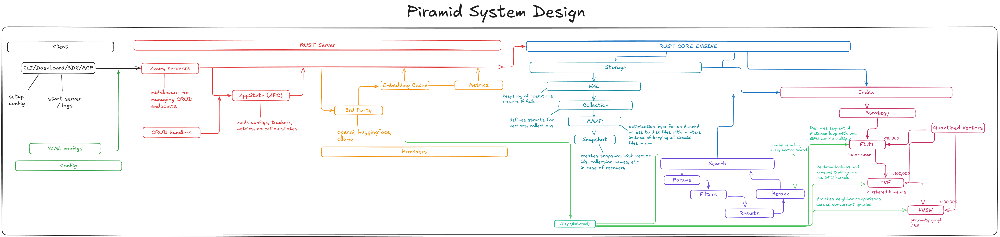

# The Evolution

I was talking with a friend from my student org one day about building something ambitious — we were throwing around ideas and landed on: what if we just built a database? Not for any particular reason at first, just because it seemed like the kind of project that would force us to understand systems at a level most people never reach. Then I had a thought: what if we used a GPU?

That was the spark. But there was a lot of context behind it.

### How I got here

By that point I’d been deep in AI for a while, and my path into it was unusual. Most people go from theory to applications — learn about neural networks, then build something with them. I went the opposite direction. I started building [AI agents](https://github.com/ashworks1706/SparkyAI), which pulled me into RAG systems, which pulled me into embeddings and transformers. Each layer dragged me deeper into the one below it. By the time I was studying transformer architectures in [DAT 494 (Advanced Deep Learning)](https://github.com/ashworks1706/LLM-from-scratch) at ASU and building LLMs from scratch, I already had practical intuition from shipping real systems.

[SparkyAI](https://github.com/ashworks1706/SparkyAI) was the project that pushed me deepest into RAG — I dove into reranking mechanisms, advanced retrieval variations, and read a stack of research papers over winter break (my [paper summaries live here](https://somwrks.notion.site/)). I was a heavy [Qdrant](https://qdrant.tech/) user by then, my go-to vector database for every hackathon I built and won. I knew the API inside and out, had read their engineering blogs, and understood the configuration at an advanced level.

Then I saw [Helix DB](https://www.helix-db.com/) — a new YC-backed vector database — and something clicked. This was exactly the kind of large-scale engineering project I’d been wanting to take on. Not another wrapper, not another MCP integration, but the actual infrastructure that the whole software industry runs on. When I think about what reflects real SWE and ML expertise, I think about databases — every company uses them, and the engineering underneath is genuinely deep.

I’d also just built [Kaelum](https://github.com/ashworks1706/Kaelum) (LATS-based inference with a reward model and online policy router), which taught me how neural network routing works. Between that and the deep RAG experience, I had this realization: instead of building smart applications on top of dumb databases, what if the database itself was natively smart? Auto-adjusted search mechanisms, intelligent index selection, a system that understands its own workload rather than being a manual machine. With the agentic boom happening, this felt like the right direction.

> Piramid is a latency-first vector database written in Rust. The goal is to keep the database and your LLM on the same device, minimize round-trips, and expose a simple HTTP API.

### Planning

I opened [Excalidraw](https://excalidraw.com) and started sketching everything I could think of: architecture, data flow, storage layout, indexing strategies, search paths, API shape, CLI flow, caching, collection lifecycle, consistency, durability, backup/restore, observability, deployment, scaling. At every step I noticed the same thing: every decision connects to five others. Nothing in database systems is isolated.

I read [Designing Data-Intensive Applications](https://www.oreilly.com/library/view/designing-data-intensive-applications/9781491903063/) cover to cover. I went through database internals papers, blog posts from Qdrant, Pinecone, and Weaviate. I spent bus rides and time between classes just consuming material about storage engines, HNSW graphs, WAL protocols, and consistency models. I never let my curiosity die or listen to people telling me that big projects are a waste of time.

### Dead ends

The biggest dead end wasn’t an algorithm or a data structure — it was code organization. I rewrote the file structure multiple times, ripping out entire modules because they didn’t make sense in context. That’s actually where I learned about naming conventions in software engineering and settled on snake_case with categorical purpose-based folder structures. It sounds mundane, but when you’re building a system this large alone, the codebase has to make sense to you months later or you’re dead.

### The constraints

This has taken about a month so far, worked on mainly during weekends. I’m building this completely alone — the Rust core, the CLI, the REST API, the [Python SDK](https://pypi.org/project/piramid/), the [npm package](https://www.npmjs.com/package/piramid), this blog, and the website — while simultaneously working in two research labs ([ARC Lab](https://arc-asu.github.io/) doing LLM alignment, previously [RISE Lab](https://home.riselab.info/) doing trajectory prediction), a part-time SWE job at [Decision Theatre](https://dt.asu.edu/), running software at [AIS](https://ais-asu.com/) and [SoDA](https://thesoda.io), taking classes, and applying for summer internships.

I’m not saying this for sympathy — I’m saying it because it explains the engineering decisions. When I chose mmap over building a buffer pool, or started with int8 quantization instead of every precision format, or shipped with two embedding providers instead of five — those were all scope decisions made by someone with about 10 hours a week. Every feature has to earn its place.

### What’s next

The next big thing is GPU parallelism through [Zipy](https://github.com/ashworks1706/zipy). IVF’s cluster scanning is embarrassingly parallel and maps naturally to GPU compute, and I think there’s a path to accelerating HNSW’s neighbor distance computations within each traversal step too. That’s the problem I’m most excited about.

But the reason I keep building is simpler than any technical goal. The world is too complex to take a right decision — it’s more about the journey and whether you feel fulfilled with it. I never let people tell me what to do. I just pick something and go with it.

> The [architecture posts](/blogs/architecture) go through each component in detail — not just what I built, but why, the dead ends, and the alternatives I considered.
