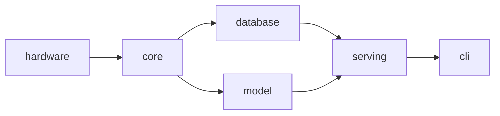
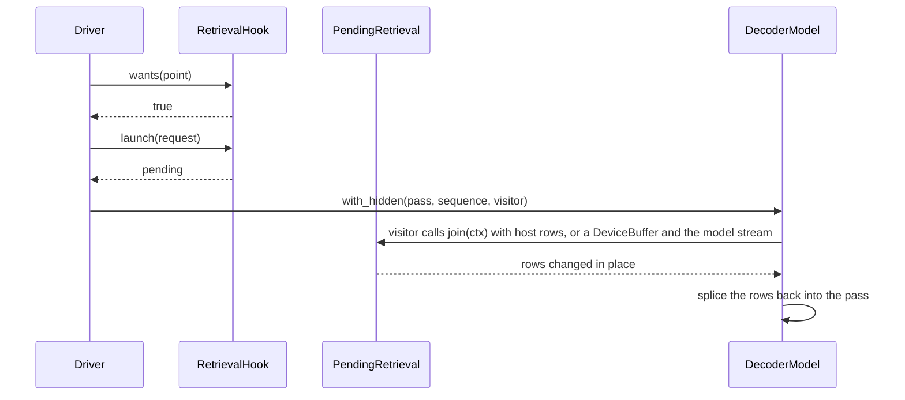
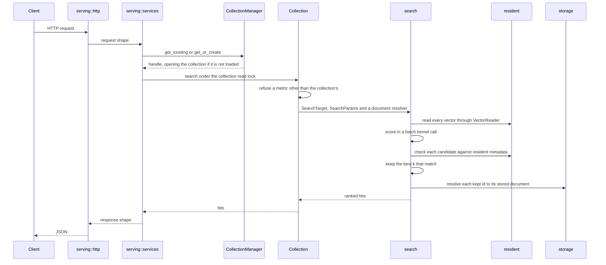
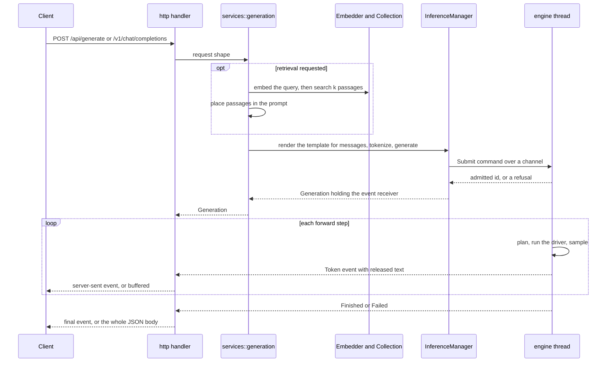
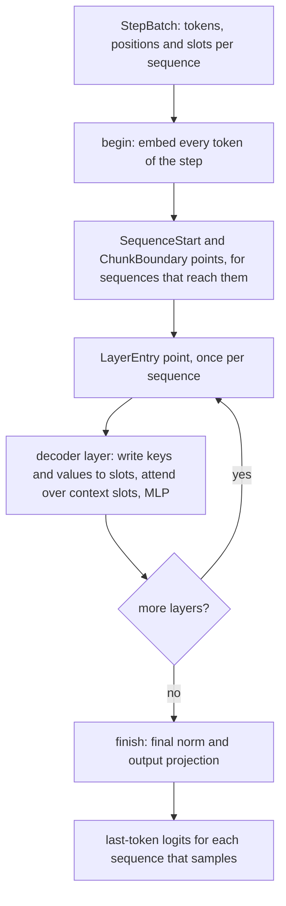
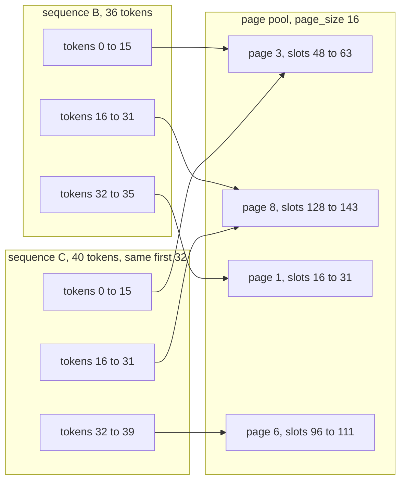
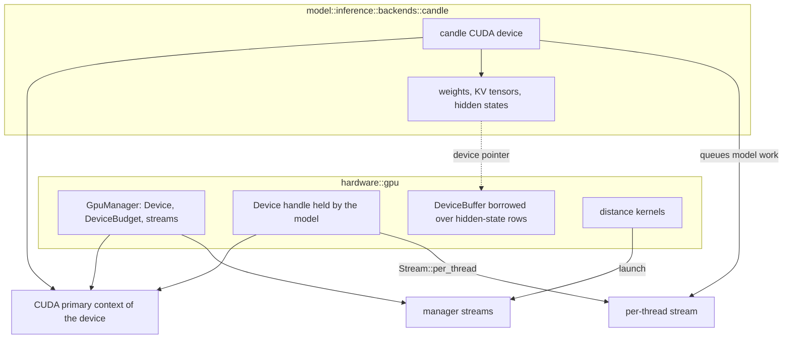
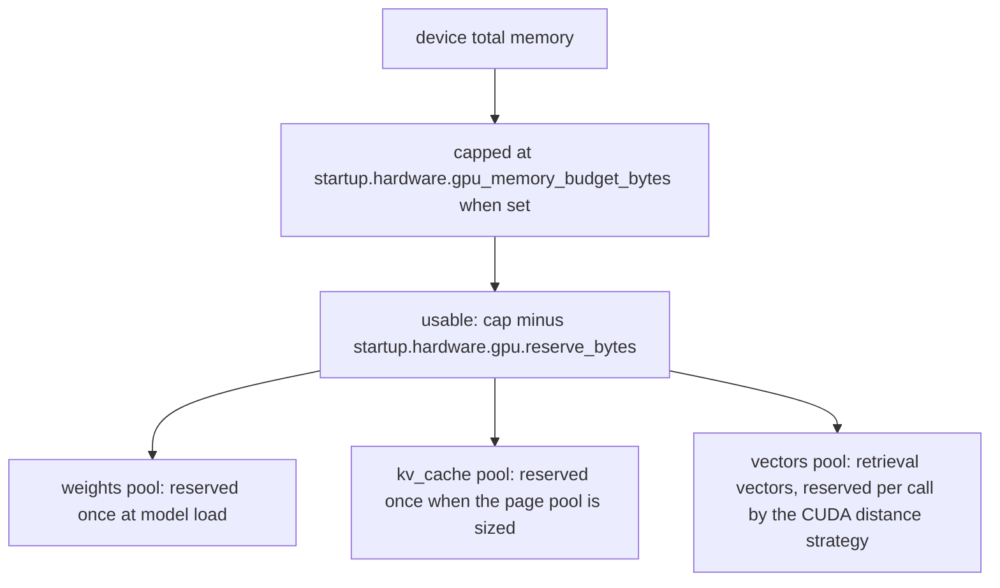
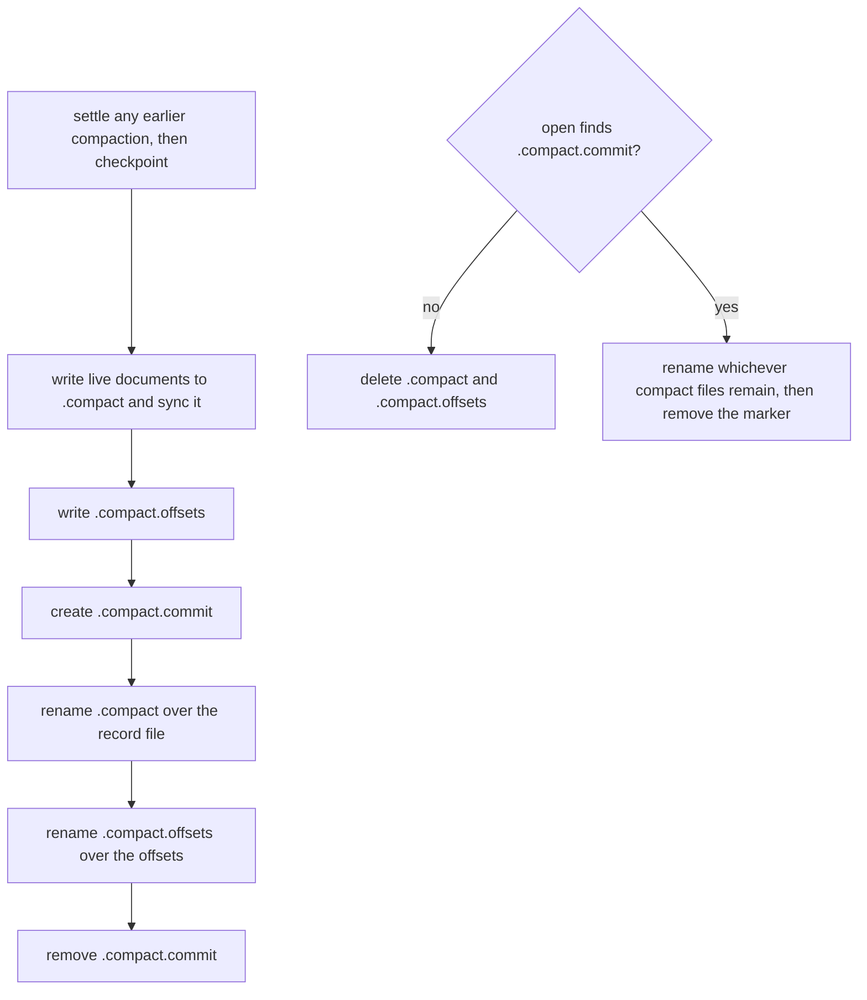

# Architecture

How the workspace is divided, why each boundary sits where it does, how a request moves through it,
and what has to stay true.

## What the shape is for

Piramid is an inference engine for retrieval-augmented generation. One process holds the documents,
the model weights and the KV cache on one device. The KV cache is the per-token attention keys and
values a model keeps so it does not recompute earlier tokens. Keeping all three together is meant to
let retrieval run during generation, not only once before it.

Generation has two phases. Prefill runs the prompt through the model and fills the KV cache for
every prompt token. Decode then produces one new token per step, reading the cache. Retrieval before
prefill needs no special structure: search, put the passages in the prompt, generate. Retrieval
during decode runs many times per sequence, is meant to overlap model compute, and reads and writes
state that lives on the device. A network hop and a host copy on every one of those calls would cost
more than the retrieval itself, which is why everything runs in one process.

Today the engine retrieves before prefill. The seam for retrieval inside the forward pass is wired
into the driver and called at every point it defines, but the only hook is one that does nothing.
Fusing retrieved data into the pass is not built yet; `docs/ROADMAP.md` schedules it.

With no network between the layers, the compiler does not stop one layer from reaching into another.
The layering is enforced instead: each layer is a crate, and `scripts/check-deps.sh` fails CI on any
dependency edge the rule below does not allow.

## The tree

```text
apps/                     everything we author
  engine/                 the library crates, one folder each
    core/                 errors, config, document, metadata, validation, stats, observability
    hardware/             compute (with quantization), gpu, host
    database/             storage, resident, search, document, collection
    model/                inference, fusion, embeddings
    serving/              http, services, state, machine, disk
  cli/                    the piramid binary, and a library with the console, the support
                          bundle and the piramid umbrella re-exports
  website/                piramiddb.com, with blog content and images inside it
  sdk/                    npm and python clients

deploy/  docs/  scripts/  .claude/  .github/     how it is built, shipped and explained
```

There is one binary, but the engine is five crates and `apps/cli` links them into one executable.
There are no grouping folders, and folder order is not dependency order.

## The crates

`hardware` is the code that changes when the machine changes. `compute` defines the distance metrics
and the strategies that run them, and holds the quantization encodings. `gpu` owns the device
runtime: opening a device, memory, streams, compiled kernels, and the device memory budget. `host`
reads processor, memory and GPU use for the console and metrics. `hardware` cannot see core's
configuration, so its quantization encoders and its GPU manager take plain values. It depends on
nothing else in the workspace, so kernels can be benchmarked on their own and both retrieval and
the model can use a device without going through each other.

`core` is the vocabulary everything shares: every error the app wraps, the whole configuration
surface, the document and hit shapes, metadata and its filters, validation, and the counters the
engine keeps about itself. All configuration lives in `core/src/config`, one flat file per domain:
the structs, their defaults, their validation, and the typed values parsed out of a setting, such
as the embedding provider, the `piramid` provider's options and a device name. No other crate
defines a configuration type. A crate that needs a setting receives the core type, or plain values
built from it. It depends on `hardware` only for types that configuration and errors
carry, such as `ExecutionMode`, `Metric` and the compute and GPU error types. `core::stats` is what
the engine measures, held as plain atomics so any crate can record into it. `core::observability` is
where those numbers go: the tracing subscriber, OTLP export and the Prometheus text format.

`database` is the corpus retrieval reads from: collections of documents, each an id, an embedding,
text and metadata. `storage` holds the record file, the write-ahead log (WAL), mmap, the manifest
and the other sidecars, which are the small files kept beside the record file. `resident` holds what
a collection keeps in memory for as long as it is open: every live vector in one contiguous buffer,
and the metadata of every live document. Both are filled at open from the record store and updated
on every insert, upsert, metadata update and delete. Nothing in them is evicted and there is no
memory budget for them, so a metadata filter never has to read a document from disk.

`search` is one exact scan. It scores the query against every stored vector with the collection's
metric, then keeps the best `k` in a single pass that also applies the metadata filter, so a
filtered query returns `k` hits whenever at least `k` documents match. A score that is NaN never
ranks. There is no approximate index. `search` takes a `SearchTarget` of borrowed views, the vectors
and the metadata, rather than a `Collection`, which keeps scoring below collection lifecycle instead
of circular with it.

`collection` composes a record store, its resident state and a checkpoint policy into one queryable
object. Its `state.rs` holds what a collection owns, the files beside it are operations on that
state such as open, checkpoint and compact, and `manager.rs` holds the `CollectionManager` that opens
and caches collections by name. The metric belongs to the collection: a new collection takes
`runtime.search.metric`, the manifest stores it, and a search that names a different metric is
refused.

`model` runs the model and turns text into vectors. It does not depend on `database`, so a
collection stays queryable with no model loaded. Inside `inference`:

- `architecture` reads what a checkpoint declares in `config.json` and defines `DecoderModel`, the
  contract a backend implements so a driver can run it one decoder layer at a time.
- `forward` is the driver. It runs a model through one step and calls the retrieval hook at every
  point the hook asks for.
- `kv_cache` decides which cache slot each token's keys and values are written to and shares full
  prefix pages between sequences. It holds no tensors.
- `batching` is the scheduler that packs decode tokens and prefill chunks into steps, and the engine
  thread that runs those steps and streams results.
- `sampling` turns logits into a token. `tokenizer` holds the tokenizer contract, the checkpoint's
  chat template and incremental detokenization.
- `backends` is the only place `candle` and `tokenizers` appear. It holds the Qwen2 and Qwen3 dense
  decoders on candle.
- `manager.rs` holds `InferenceManager`, the entry point the server holds.

`model::fusion` holds the `RetrievalHook` trait and the no-op hook. `model::embeddings` holds the
embedding providers: an OpenAI-compatible HTTP client, Ollama, and `piramid`, which runs an
embedding checkpoint in this process.

`serving` is how the outside world reaches the engine. `http` holds axum routes, handlers,
authentication, rate limiting and request ids. `services` holds the use cases behind the handlers,
their wire shapes in `services/api`, and conversion. `state` holds `AppState`, which composes the
collection manager, the embeddings manager, the optional GPU manager and the optional inference
manager.

`apps/cli` has two targets. The binary, `main.rs`, parses arguments, loads configuration, opens the
GPU and loads the model at boot, starts the server, and ends the process on failure; it is the only
code that may. The library holds the terminal console and the support bundle, so their tests can
reach them, and the `piramid` umbrella re-exports of the engine crates.

## The dependency rule

An arrow points from a crate to the crates allowed to depend on it. A crate may also depend directly
on anything upstream of it along the arrows, so `serving` may name `hardware`, but `model` may not
name `database`. Any other edge is a violation.



`scripts/check-deps.sh` holds the allow-list, checks that `hardware` is a leaf, and checks that
`model` does not depend on `database`. Adding an edge means editing that script and this document in
the same change.

| Crate | Owns | Must not |
|---|---|---|
| `hardware` | Distance math and strategy dispatch, quantization encodings, the device runtime and memory budget, device kernels, host readings | Depend on anything in the workspace, or let vendor types leave `gpu/backends` or `host/nvml.rs` |
| `core` | Every error the app wraps, all configuration, document and hit shapes, metadata and filters, validation, stats, telemetry export | Name an HTTP type or end the process |
| `database` | Records, WAL, sidecars, mmap; resident vectors and metadata; exact scoring, filtering and ranking; the `Collection`, its checkpoint and compaction | Serve HTTP |
| `model` | Model execution, KV cache bookkeeping, scheduling, sampling, tokenization; the `RetrievalHook` seam; embedding providers | Depend on `database`, or be required for retrieval to work |
| `serving` | Routes, handlers, services, wire shapes, `AppState` | Touch file formats, search internals or model internals |
| `apps/cli` | Argument parsing, boot order, process lifecycle, terminal output | Contain domain logic |

## What it is built on

Rust 1.87, edition 2021. One binary with no services to install beside it: the storage engine,
search, the model runtime and the HTTP server are all in-process.

`axum` and `tower-http` on `tokio` serve HTTP. `serde` handles JSON on the wire and YAML in the
configuration file, and `bincode` encodes the sidecars. Errors are `thiserror` enums per layer;
there is no `anyhow` in the libraries because a caller has to be able to match on an error. `wide`
gives portable SIMD, `rayon` runs batch work, `memmap2` maps the record file, and `dashmap`,
`parking_lot` and `lru` hold shared state. `tracing` carries logs and spans, with OTLP export.
`clap` parses the command line and `ratatui` draws the console. Models run on `candle`, tokenize
with `tokenizers`, and render chat templates with `minijinja`. The CUDA runtime is `cudarc`, with
kernels compiled at run time by NVRTC, and GPU readings come from `nvml-wrapper`. The website is
separate and ships nothing into the binary.

Three product features exist, all additive and off by default:

- `gpu-cuda` enables `cudarc` in `hardware::gpu::backends`, `nvml-wrapper` in `hardware::host`, and
  candle's CUDA support.
- `inference-candle` enables `candle` and `tokenizers` in `model::inference::backends`, and with it
  model loading and the `piramid` embedding provider.
- `otel` enables OTLP trace export.

Every test lives in its crate's `tests/` directory and uses the crate's public API; `src/` holds no
test modules. A crate whose tests need fixtures, such as the tiny random Qwen models and fake
tokenizers in `model`, puts them behind its own `test-support` feature. The crate turns that feature
on through a dev-dependency on itself, so the fixtures are compiled only for its tests.

So `cargo build` needs no CUDA toolkit and no model runtime. A build without a feature refuses the
settings that need it: enabling inference or the `piramid` embedding provider without
`inference-candle`, or the GPU profile without `gpu-cuda`, is an error at startup that names the
feature.

## The three seams

Everything else is infrastructure for these. Change them deliberately.

### `compute::DistanceKernels`

One strategy per file in `compute/strategies/` and one arm in the registry. The strategies are
scalar, SIMD, parallel and, under `gpu-cuda`, CUDA. Every strategy implements the whole trait: the
pairwise methods and the batch methods. There are no default methods to fall back on.

```rust
fn cosine_batch(&self, query: &[f32], candidates: &[f32], dim: usize, out: &mut [f32])
    -> ComputeResult<()>;
```

`candidates` is a contiguous row-major slab, not `&[Vec<f32>]`. A slab uploads to a device in one
copy. A slice of `Vec`s is scattered allocations that a device strategy would have to gather on
every call, and that gather costs more than the kernel saves. `out` is caller-owned so the buffer
can be reused.

`compute::strategies::for_mode` is how a caller gets a strategy to run, and it checks availability
itself. A mode this build or this machine cannot run is an error, not a fallback: a caller that
asked for one strategy and silently got another has no way to know where its numbers came from.

The CUDA strategy runs on the device the GPU manager opened at boot, on the first of its streams. It
uploads the query and candidates, runs the distance kernels, and downloads the scores on every call,
reserving those bytes from the vectors pool of the device budget while it runs. Keeping candidates on
the device across queries is a roadmap item.

### `storage::vectors::VectorReader`

How search reads vectors it does not own, so the backing store can change without touching search.
`as_slab()` is the fast path: the whole set as one contiguous buffer. A reader over scattered
allocations returns `None` rather than silently copying, so the cost stays visible. `gather_into()`
copies chosen rows into a caller buffer and works for any reader. Both have default implementations,
so a new reader costs nothing, but a wrapper that forwards the trait must forward every method or it
hides a capability the reader underneath has.

`resident::VectorStore` is the reader a collection hands to search: one `Vec<f32>` at a fixed
stride, with a map from `Uuid` to a `u32` row ordinal. Ordinals are stable: a removed row becomes a
hole instead of being filled by moving the last row, and the next insert reuses it. `as_slab`
returns the whole buffer with the id and a liveness flag for each row. A hole holds stale floats, so
the batch kernel still scores it and search drops its score before ranking. Search scores the slab
in one batch call when `as_slab` returns one, and otherwise gathers the rows that pass the filter in
chunks through `gather_into` and scores each chunk.

### `model::fusion::RetrievalHook`

Where retrieval enters the forward pass.

```rust
trait RetrievalHook: Send + Sync {
    fn name(&self) -> &'static str;
    fn wants(&self, point: RetrievalPoint) -> bool;
    fn launch(&self, request: &RetrievalRequest<'_>) -> Result<Box<dyn PendingRetrieval>>;
}
trait PendingRetrieval: Send {
    fn join(self: Box<Self>, ctx: &mut ForwardContext<'_>) -> Result<()>;
}
```

The seam says when retrieval may run and what it may touch. It does not say how retrieved data is
combined with the model. There are three points: `SequenceStart`, on the step that computes a
sequence's first tokens; `ChunkBoundary`, on the step after a sequence has generated another
`runtime.inference.fusion.chunk_tokens` tokens; and `LayerEntry`, before every decoder layer.
`launch` gets a read-only request carrying the point, the sequence's tokens so far and the hidden
width. `join` gets a `ForwardContext` whose `HiddenState` is either a host slice or a
`DeviceBuffer`, and on a device the stream model work is queued on.

Two properties of this shape matter. A device hidden state means a hook can change the pass without
a device-to-host-to-device copy on every call, which is the data movement co-location exists to
remove. And splitting `launch` from `join` means a search can run on its own stream while the model
keeps computing; a single call would serialize the two however it was implemented. Today the driver
joins immediately after launching, so nothing overlaps yet.



When `wants` returns false, as it always does for `NoopRetrievalHook`, the driver does nothing at
that point. The binary always passes the no-op hook. A hook that actually searches a collection
depends on `database`, so it belongs in its own crate depending on both `model` and `database`.
That keeps `inference` free of the retrieval stack.

## Retrieval request flow



Each conversion has one place: HTTP in `serving::http`, operational decisions and wire shapes in
`serving::services`, domain mutation on the `Collection`, bytes and files in `storage`. Scores come
from the resident vectors; only the `k` documents that are returned are read from the record store.
Text search embeds the query with the configured provider first and then runs the same search.

## Generation request flow

Settings named in this section and in the KV cache section are under `runtime.inference`.

`InferenceManager::load` runs at boot when `runtime.inference.enabled` is set. It reads the
checkpoint spec and chat template, checks the sampling defaults, loads the tokenizer, reserves
device memory for the weights when the model runs on a GPU, loads them, sizes and reserves the KV
page pool, optionally runs one warm-up step, and starts the engine thread. After that the manager
holds the tokenizer, the chat template and a channel to the thread. The model, the scheduler and the
page pool belong to the thread.



`/api/generate` takes either a raw `prompt` or chat `messages`, and optionally a `retrieval` block
naming a collection, `k` and an optional query. Retrieval embeds the query, or the prompt or last
user message when none is given, with the configured provider and searches the collection. With a
raw prompt the passages are prepended as a numbered block and the prompt is not templated. With
messages the passages go into the system message and the conversation is rendered through the
checkpoint's chat template. `/v1/chat/completions` is the OpenAI-compatible route: it always renders
the template and has no retrieval. Tokenization happens on the request task, before the engine sees
the request.

Every generation is a stream of `GenerationEvent`s: `Token` events carrying the text the token
releases, then exactly one `Finished` or `Failed`. The handler turns that stream into a JSON body,
native server-sent events (`retrieval`, `token`, `done`, `error`), or OpenAI chunks ending in
`[DONE]`.

### The engine thread

One OS thread runs the loop in `batching::worker`. When nothing is queued or running it blocks on
the command channel. Otherwise it first handles every command already waiting, then fails queued
sequences that have not started and have waited longer than `batching.queue_timeout_ms`, removes
queued and running sequences whose caller has dropped the event receiver, plans a step, runs it
through the driver, samples a token for each sequence whose step ended at its last token, and sends
events. If no step can be planned, the first sequence fails because the cache cannot hold it. If a
forward step fails, every sequence in that step fails with the error. On shutdown every queued and
running sequence gets `Failed`.

A sequence finishes with `Stop` on an end-of-sequence token or a completed stop string, and with
`Length` at `max_new_tokens` or `max_sequence_length`. Text that could be the start of a stop string
is held back until it either completes one or cannot. Detokenization is incremental: text is
released only once the tokens behind it decode to complete characters. Sampling applies a repetition
penalty over a window of recent tokens, then takes the argmax at temperature zero, or draws with
temperature, top-k and top-p from a per-sequence generator that a seed makes reproducible.

### The scheduler

Continuous batching means admitting new sequences into a running batch between steps rather than
waiting for the batch to drain. Chunked prefill means splitting a long prompt across several steps
so it does not stall decoding for everyone else. They are `batching.continuous` and
`batching.chunked_prefill`.

`Scheduler::plan` fills a step within `batching.max_batched_tokens` in a fixed order:

1. One decode token for each running sequence that has only one token left to compute.
2. A chunk for each running sequence with more than one token left to compute.
3. New sequences from the front of the queue, while fewer than `batching.max_batch_size` sequences
   are running, and only if continuous batching is on or nothing is running.

Admission refuses at submit, before anything is queued, a request that can never run: an empty
prompt, a prompt plus `max_new_tokens` over `max_sequence_length` or over the whole cache, a prompt
over `max_batched_tokens` without chunked prefill, or a full queue, counted as queued plus running
against `batching.max_queue_depth`.

When a running sequence needs a page for its next tokens and none is free, the scheduler preempts
running sequences, most recently admitted first and skipping any already placed in this step, until
the pages fit. Preemption is by recompute: the victim's pages are released, its progress resets to
zero, and it returns to the front of the queue with its prompt and generated tokens. When it is
admitted again those tokens are prefilled again, reusing any shared prefix pages still cached. The
other policy, swapping pages to host memory, is not implemented and configuration refuses it.

### One forward step



All sequences in a step share one hidden-state tensor. Attention runs per sequence: it writes the
new keys and values into the slots the scheduler assigned, gathers the sequence's context slots from
the cache, and attends over them. There is no paged-attention kernel yet, so that gather is a copy
on every layer of every step.

## The KV cache

The cache is a pool of fixed-size pages of `kv_cache.page_size` tokens. A slot is one token's place
in the pool, numbered `page * page_size + offset`. Each sequence holds a block table: the list of
its pages in token order. The backend keeps one key tensor and one value tensor per layer, each with
one row per slot, and writes and reads them by slot number. `kv_cache` never touches those tensors;
it only hands out slot numbers.

Prefix sharing, on with `kv_cache.prefix_sharing`, reuses the pages of an earlier sequence with the
same leading tokens. A full page is identified by a hash of its tokens chained with the hash of the
page before it, so a match means the whole prefix matches, and the tokens are compared as well. When
a sequence is removed, its full computed pages are published. A later prompt starts by taking every
published page that matches its prefix, except that the last prompt token is never shared, so at
least one token is always computed. A published page that no sequence holds stays cached until an
allocation finds no free page, and then it is evicted, the page released longest ago first.



Here pages 3 and 8 were published by an earlier sequence with the same first 32 tokens, and both B
and C took them at admission. Each then got a private page for the rest.

The pool is sized once, at load. One token takes `2 * layers * kv_heads * head_dim` elements at the
cache precision, `kv_cache.dtype`. On a GPU the byte budget is the smallest of
`kv_cache.device_fraction` of free device memory, what the budget's KV pool has left, and
`kv_cache.max_bytes` when set. On the CPU `kv_cache.max_bytes` is required. The page count is that
budget divided by the bytes in one page. The cache lives in memory only; a restart loses every
in-flight generation.

## One device, two runtimes on it

Candle builds and runs the model: weights, projections, norms, attention. `hardware::gpu` is
Piramid's own device runtime, used for distance kernels and for handing hidden states to a hook.
Both run on the same device in the same process.

They can share memory because both open the device through its CUDA primary context, the one context
per device that every library in a process can retain. A device address allocated by one is valid in
the other. They can share ordering because candle queues model work on cudarc's per-thread stream,
and `gpu::Stream::per_thread` names that same stream. A stream is an ordered queue of device work;
work on different streams may overlap. Kernels are compiled from source at run time with NVRTC and
launched through `gpu::KernelModule`.



The two backend modules exchange a device pointer and a stream identifier, never a vendor type. On a
CUDA model, `with_hidden` wraps the step's hidden-state rows in a borrowed `DeviceBuffer`, which
never frees the memory, and passes the per-thread stream beside it. Hook kernels launched on that
stream run in order with the model. The rows are narrowed out of the step's hidden-state tensor,
converted to f32 when the model runs at another precision, and spliced back into the pass after the
hook returns. On the CPU the same rows are copied into a host vector instead and copied back the
same way.

The GPU manager is opened at boot under `startup.hardware.profile: gpu`, before the model loads, and
the CUDA distance strategy is installed from it. The model runs on `cuda:N` only when that profile
opened device N: configuration validation refuses a `runtime.inference.device` naming any other
device, and with no device set the model goes to the opened GPU, or to the CPU without the profile.
The only device kernels today are the distance kernels; the attention and quantization kernel files
are placeholders.

## Device memory budget

`gpu::DeviceBudget` is the one account of device memory. It does not allocate anything. Code that is
about to use device memory reserves the bytes first and holds a `Reservation` that returns them when
dropped.



With `startup.hardware.vram.enabled`, each pool's capacity is its share of the usable bytes, set by
`vram.weights_ratio`, `vram.kv_ratio` and `vram.vectors_ratio`, and one pool cannot take another's
space. With it off, all three draw from one shared total, first come first served.
`gpu.reserve_bytes` covers what the budget does not see, such as library workspaces and
fragmentation. The `piramid` embedding provider loads its own model and does not reserve from the
budget.

## Embeddings

`startup.embedding` configures one provider, built at boot and held by `EmbeddingsManager`,
optionally behind a cache keyed by input text. `openai` speaks the OpenAI embeddings wire format to
any server that implements it, and `ollama` speaks Ollama's. `piramid` loads a Qwen embedding
checkpoint into this process with the same candle backend as generation, on the device its options
name, `cpu` by default. It runs one sequence at a time behind a lock and returns the last token's
hidden state, L2-normalized. It needs the `inference-candle` feature. Retrieval for generation and
the text search routes both use this provider.

## Durability

The record file and its sidecars are the source of truth. The resident vectors and metadata are
copies kept in memory and must stay rebuildable from stored records. There is no index file; a
collection holds its record file, the offsets sidecar mapping each id to its bytes in the record
file, the manifest, the WAL and its checkpoint bookkeeping.

A write checks the vector against the collection's width and metric, encodes the document and
checks collection limits, logs a WAL entry, appends the record, updates the offsets, then the
manifest and the resident vector and metadata. After the write, a checkpoint condition on operation
count, elapsed time or log size may trigger a checkpoint. A checkpoint syncs the record file, saves
the manifest and the offsets, and only then writes a checkpoint entry to the WAL, records the last
sequence number and rotates the log. Every sidecar is written to a temporary file, synced and renamed
into place, and the directory is synced after the rename. Byte-level serialization stays in
`storage`.

Opening a collection loads the manifest, finishes or discards an interrupted compaction, and loads
the offsets. A manifest at schema version 1 is refused with an error naming the collection and
saying it was written by Piramid 0.2 and must be re-ingested; nothing in it is read or migrated.
Stored documents with no manifest are refused. A collection with neither is new: it gets a schema 2
manifest carrying `runtime.search.metric`, written at once. Open then opens the record file and the
WAL, reads the resident vectors and metadata of every document the offsets name, and replays WAL
entries past the last checkpoint. When entries were replayed, the collection checkpoints before it is
returned. A `.vecindex.db` file left by Piramid 0.2 is never read, but deleting a collection still
removes it.

### Compaction

Compaction rewrites the record file without the space dead and replaced records take up. It holds
the collection's write lock throughout, and a crash at any step leaves a collection that opens with
every live document. Three extra files beside the record file make that possible: `.compact`, the
new record file; `.compact.offsets`, its offsets; and `.compact.commit`, an empty marker whose
presence means the compaction is committed.



Before the marker exists, the old record file and offsets are untouched, so open discards the
compacted files. Once it exists, the compacted files are complete and synced, so open moves any that
are still present into place, in the same order compaction does, and removes the marker. Each rename
is followed by a directory sync. The checkpoint at the start empties the WAL, so replay after a
finished compaction has nothing that points into the old record file. If a committed compaction
cannot be finished in the running process, the collection refuses every write and checkpoint until
it is opened again, where open finishes it.

## Configuration

One file, split into blocks by when a setting takes effect rather than by which subsystem reads it:

```yaml
startup:   # applied once at boot; changing one needs a restart
runtime:   # re-read on POST /api/config/reload
console:   # read when the terminal UI starts
```

`console` is in the same file because the terminal UI is part of Piramid, not a second product with
its own configuration. Its `base_url` defaults to the address `startup.bind` names, so the port is
set in one place.

The split exists because grouping by subsystem once produced a reload that returned 200 and changed
nothing. A reload now compares the incoming startup block with the one the process booted with and
refuses if it differs. It applies the runtime settings an open collection reads as it runs, and
refuses a change to one a collection reads only when it opens, naming the key. `runtime.inference`
is the exception inside the runtime block: the model is loaded with it at boot, so a reload that
changes it is refused with a message saying a restart is needed. `runtime.search.metric` is not
refused, but it is only read when a collection is created: an existing collection keeps the metric
its manifest stores, so a change affects only collections created afterwards.

Three rules keep the surface legible:

- One place per setting. A setting that can be spelled two ways is a bug.
- Nothing is silently ignored. Every block uses `deny_unknown_fields`. Settings whose code is not
  written yet exist so the shape is fixed before the work lands, and validation refuses any value
  other than the default, naming the key. Today that is every key under `runtime.inference.fusion`
  except `chunk_tokens`, every key under `runtime.inference.document_kv`,
  `runtime.inference.kv_cache.preemption: swap`, `startup.hardware.vram.retrieval_bandwidth_share`
  and every key under `runtime.quantization`.
- The example is tested. `config.example.yaml` is the whole surface at its defaults, and tests assert
  it deserializes to exactly `Config::default()` and that every key appears in it.

Environment variables are overrides only, spelled mechanically from the path:
`runtime.wal.max_log_size` is `PIRAMID__RUNTIME__WAL__MAX_LOG_SIZE`, parsed as YAML so `8`, `true`
and `null` mean what they mean in the file. `PIRAMID_API_KEY` and `OPENAI_API_KEY` are read only
from the environment, never from the file or an override, so a key is never written into a file
that gets shared. `OPENAI_API_KEY` is read only when `startup.embedding.provider` is `openai`. A variable that
is not valid UTF-8 is an error rather than being treated as unset. The support bundle lists which
variables are set and redacts credential values.

## Errors

`core` is transport-agnostic. `PiramidError::kind()` returns an `ErrorKind`, such as `BadRequest`,
`NotFound`, `Unavailable` or `Internal`, with no notion of a status code. `serving::http::ApiError`
is a newtype in the transport layer that maps a kind to an HTTP status and renders JSON. Handlers
use `?` because `ApiError` converts from anything that converts into `PiramidError`, and because the
`IntoResponse` impl is on a local newtype, the orphan rule is not a problem. Errors from a streamed
generation arrive as a `Failed` event and are rendered inside the stream.

## Invariants

1. `hardware` depends on nothing in the workspace.
2. No library crate calls `std::process::exit`. Configuration loading returns a `Result`.
3. `core` never names an HTTP type.
4. Vendor SDK types, `cudarc`, `nvml-wrapper`, `candle` and `tokenizers`, never leave their backend
   modules: `hardware::gpu::backends`, `hardware::host::nvml` and `model::inference::backends`.
5. `unsafe` appears only at the audited sites, each with a `// SAFETY:` comment.
6. The resident vectors and metadata are rebuildable from the record store.
7. Retrieval works with no model loaded, and `model` depends on nothing in the retrieval stack.
   `model::fusion` holds the trait and the no-op hook; a hook that searches a collection is a
   separate crate.
8. Default builds are CPU-only and need no vendor toolchain and no model runtime.
9. Telemetry speaks protocols, not products. Nothing is sent to this project under any
   configuration.
10. The engine thread alone owns the loaded model, the scheduler and the KV page pool. Everything
    else reaches them through the command channel and receives results as events.

## Where new code goes

| What | Where |
|---|---|
| Routes and handlers | `serving/src/http` |
| Wire shapes, and coordinating a user-facing operation | `serving/src/services` |
| Collection state, records, WAL, sidecars, resident state, search | `database` |
| Distance math, strategy dispatch, device memory, device kernels, host readings | `hardware` |
| A distance strategy | one file in `hardware/src/compute/strategies` and one arm in its registry |
| A kernel the forward pass launches on model memory | `hardware/src/gpu/kernels`, called from `model/src/inference/backends` |
| A model architecture | `model/src/inference/architecture` for the spec, `model/src/inference/backends` for the implementation |
| Scheduling, KV cache policy, sampling, tokenization | `model/src/inference` |
| An embedding provider | `model/src/embeddings/providers` |
| A retrieval hook that searches a collection | a new crate depending on `model` and `database`, added to `scripts/check-deps.sh` and this document |
| Shared vocabulary: errors, config, metadata | `core` |
| A site or a client library | `apps/` |
| A container image or compose file | `deploy/` |

If a change touches three or more crates, start at the service boundary and make the data flow
explicit before writing anything.
