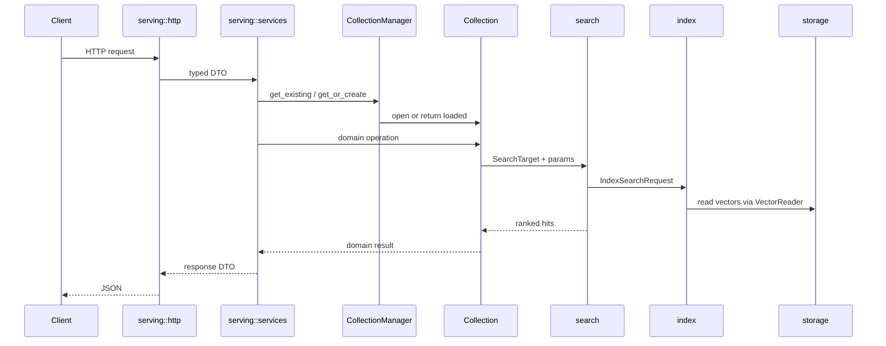

# Architecture

How the workspace is cut, why each boundary sits where it does, and what has to stay true.

## The problem this shape solves

Piramid runs retrieval and, eventually, transformer inference in one process, on one device, so that
retrieval can happen during generation rather than once before it. Retrieval inside a generation —
repeated, overlapped with compute, against device-resident state — cannot afford a service boundary;
retrieval before prefill costs one hop and does not need one.

That single-process goal is why internal boundaries matter: with no network between the layers,
nothing keeps them from growing into each other except discipline, and discipline that nothing
checks tends not to survive. So the layering is physical. Each layer is a crate, and
`scripts/check-deps.sh` fails CI on an edge that isn't in the rule below.

## The tree

```text
apps/                     everything we author
  engine/                 the library crates, one folder each
    core/                 errors, config, document, metadata, validation, stats, observability
    hardware/             compute, gpu, quantization, host
    database/             storage, index, search, cache, document, collection
    model/                inference, fusion, embeddings
    serving/              how the outside world reaches it
  cli/                    the piramid binary, which links the engine into one artifact
  website/                piramiddb.com, with blog content and images inside it
  sdk/                    npm and python clients

deploy/  docs/  scripts/  .claude/  .github/     how it's built, shipped, and explained
```

`engine/` says what the thing is; "crates" describes Rust's compilation model, not the product. One
binary doesn't mean one folder — the engine is five crates and `apps/cli` links them into an
artifact.

Each cut is a real one:

- **`hardware`** is the code that changes when the machine changes. `compute` owns what cosine means
  and which strategy runs it, `gpu` owns the device, `quantization` owns the encodings both score
  over, `host` reads the processor and memory use of the machine itself. It is a leaf, so kernels can be benchmarked on their own and `model` can get a device
  without reaching through retrieval math.
- **`database`** is where vectors live and how they are found: records, WAL, mmap and sidecars; the
  ANN indexes; query planning and scoring; and `collection`, the object composing a store, a cache,
  a checkpoint policy and an index. Inside it, `state.rs` holds what a collection owns and every
  file beside it is one thing done to that state — opening, checkpointing, compaction, write
  limits. `search` takes a `SearchTarget` rather than a `Collection`, which is what keeps scoring
  below collection lifecycle instead of circular with it.
- **`model`** is the forward pass, the `fusion` seam retrieval enters it through, and the
  `embeddings` providers that turn text into a vector. It depends on nothing in the retrieval
  stack, which is what keeps a collection queryable with no model loaded.
- **`core`** is the vocabulary everything shares: errors, the whole configuration surface, the
  document and hit shapes, metadata and its filters, validation, and the counters the engine keeps
  about itself.
- **`serving`** is how the outside world reaches it, and nothing else.

`core::stats` and `core::observability` split a concern that reads as two names for one thing.
`stats` is what the engine measures, held as plain atomics with no dependency on an exporter, so any
crate can record into it freely. `observability` is where those numbers go, and it carries
`tracing-subscriber` and OpenTelemetry.

One folder per crate, no grouping folders. Folder order is not dependency order — `core` depends on
`hardware` for the `ExecutionMode` and `Metric` types that configuration carries.

## The dependency rule

A crate may depend on one listed below it. The reverse is a violation.

```
hardware ─→ core ─┬─→ database ─→ serving ─→ cli
                  └─→ model ────┘
```

`scripts/check-deps.sh` holds the allow-list. Adding an edge means editing that file and this
document in the same change.

| Crate | Owns | Must not |
|---|---|---|
| `core` | Every error the app wraps, all configuration, the document and hit shapes, metadata and its filters, validation, `stats`, and the telemetry export those feed | Know about HTTP or end the process |
| `hardware` | Distance math and strategy dispatch, the device runtime, quantization encodings, host readings | Depend on anything in the workspace, or let vendor types escape `gpu::backends` |
| `database` | Records, WAL, sidecars, mmap; ANN traversal and the sidecar format; planning, filtering, scoring; the `Collection`, its caches, checkpoint and compaction | Serve HTTP |
| `model` | Model execution, KV cache, batching, sampling; the `RetrievalHook` seam; embedding providers | Depend on `database`, or be required for retrieval to work |
| `serving` | Routes, handlers, services, wire shapes, `AppState`, routing | Touch file formats or index internals |
| `apps/cli` | Argument parsing, process lifecycle, terminal output | Contain domain logic |

`hardware` is a leaf because kernels should be liftable into a standalone benchmark, and because a
kernel layer that imports application configuration can't be reasoned about on its own. It also
means `compute` and `inference` share one `Device` — which is what puts vectors and model weights in
the same address space.

## What it's built on

Rust 1.87, edition 2021. One binary, no runtime services to install alongside it: the storage
engine, the indexes and the HTTP server are all in-process.

`axum`/`tower-http` on `tokio` for HTTP, `serde` with JSON on the wire and `bincode` in the
sidecars, `thiserror` enums per layer (no `anyhow` in libraries — a caller has to be able to match),
`wide` for portable SIMD, `rayon` for batch work, `memmap2` for records, `dashmap`/`parking_lot`/
`lru` for shared state, `tracing` with OTLP for telemetry, `clap` for the CLI, `criterion` for
benches. The website is separate and ships nothing: Next.js, TypeScript, Tailwind, MDX.

Two features are reserved for vendor runtimes — `gpu-cuda` for `cudarc` in `gpu/backends/`, and
`inference-candle` for `candle` in `inference/backends/`. Both are additive and off by default, so
`cargo build` needs no CUDA toolkit and no model runtime, and an unavailable strategy reports
`false` rather than pretending. Vendor types never escape those backend modules, which is what
allows a second backend later without touching the layers between.

## The three seams

Everything else exists to make these cheap to implement and swap.

### `compute::DistanceKernels`

One strategy per file in `compute/strategies/`, one arm in the registry. Nothing else changes.
"Backends" means the vendor layer and nothing else.

```rust
fn cosine_batch(&self, query: &[f32], candidates: &[f32], dim: usize, out: &mut [f32])
    -> ComputeResult<()>;
```

`candidates` is a contiguous row-major slab, not `&[Vec<f32>]`. A slab uploads to a device in one
memcpy; a slice of `Vec`s is scattered allocations a device backend would have to gather on every
call, and that gather costs more than the kernel saves. `out` is caller-owned so the buffer can be
reused and pinned later. CPU backends get correct batch behaviour from defaults that loop over the
pairwise methods; a device backend overrides them with a real launch.

`backends::for_mode` is the only lookup and it checks availability itself. A mode this build or this
machine cannot run is an error, not a fallback — a caller that asked for one backend and silently
got another has no way to know its numbers came from somewhere else.

### `storage::vectors::VectorReader`

How an index reads vectors it doesn't own, so the backing store can change without touching any
index. `as_slab()` is the fast path; a reader over scattered allocations returns `None` rather than
silently copying, because hiding that cost would make the CPU/device choice unmeasurable.
`gather_into()` is the portable fallback. Both have defaults, so a new reader costs nothing — but a
wrapper that forwards the trait must forward every method, or it withdraws a capability the reader
underneath still has.

`VectorStore` is the contiguous one: one `Vec<f32>` at a fixed stride with a `Uuid → u32` ordinal
map, so hot structures can hold a 4-byte handle instead of a 16-byte key. Ordinals are stable — a
removed row becomes a hole rather than being filled by moving the last row into it, because a moved
row invalidates every adjacency list referencing it. A hole holds stale floats a batch kernel cannot
skip, so `as_slab` reports `None` until an insert reuses it or compaction rebuilds the store.

### `model::fusion::RetrievalHook`

Where retrieval enters the forward pass.

```rust
fn wants(&self, point: RetrievalPoint) -> bool;
fn launch(&self, request: &RetrievalRequest<'_>) -> Result<Box<dyn PendingRetrieval>>;
// ... the driver does model work here ...
fn join(self: Box<Self>, ctx: &mut ForwardContext<'_>) -> Result<()>;
```

Mechanism-agnostic on purpose: it says when retrieval may occur and what it may touch, not how
retrieved data gets combined. Two things in that signature are load-bearing. `ForwardContext` carries
a `HiddenState` that is either a host slice or a `DeviceBuffer`, because a host-only seam would force
a device-to-host-to-device copy per invocation — exactly the data movement co-locating retrieval and
inference exists to remove. And the `launch`/`join` split is what lets search overlap model compute
on its own stream; a single fused call serializes them however it is implemented.

It exists before anything calls it because a driver written without the seam is hard to retrofit
with one, and a driver written with it costs nothing extra. A strategy that actually queries an
index depends on `search`, so it belongs in its own crate depending on both — that's what keeps
`inference` free of the retrieval stack.

## Request flow



Conversion boundaries are explicit: HTTP shapes in `serving::http`, operational decisions in
`serving::services`, domain mutation on the `Collection`, bytes and files in `storage`.

## Durability

The record store plus sidecars are the source of truth; cache and index are acceleration structures
that have to stay rebuildable from stored records. A write logs a WAL entry, appends the record,
updates the offset index, then the caches and the ANN structure — and a checkpoint condition may
flush sidecars. `CheckpointManager` owns collection-level bookkeeping and WAL rotation; byte-level
serialization stays in `storage`, except that an index owns its own sidecar format. On open, the
builder loads sidecars, opens the record store, initializes the WAL, and replays if needed.

## Configuration

One file, blocks split by *when a setting takes effect* rather than by which subsystem owns it:

```yaml
startup:   # applied once at boot; changing one needs a restart
runtime:   # re-read on POST /config/reload
console:   # read when the terminal UI starts
```

`console` is in the same file because the terminal UI is part of Piramid, not a second product with
a configuration system of its own. Its `base_url` defaults to the address `startup.bind` names, so
moving the port is said once.

The split is by lifecycle because grouping by subsystem had already produced a bug: a reload
returned 200 and silently changed nothing. Which block a key is in is now the answer to "do I need
to restart?", and `reload_config` compares the incoming startup block against the booted one and
errors if it differs. `runtime` is honest about its reach — a reload applies to collections opened
after it, not to collections already in memory.

Three rules keep the surface legible:

- **One place per setting.** A knob that can be spelled two ways is a bug.
- **Nothing is silently ignored.** `deny_unknown_fields` throughout. Settings whose code isn't
  written yet exist so the shape is fixed before the work lands, and `validate` refuses them rather
  than accepting a value nothing reads.
- **The example is tested.** `config.example.yaml` is the whole surface at its defaults, with tests
  asserting it deserializes to exactly `Config::default()` and that every key appears in it.

Environment variables are overrides only, spelled mechanically from the path:
`runtime.cache.max_bytes` is `PIRAMID__RUNTIME__CACHE__MAX_BYTES`, parsed as YAML so `8`, `true` and
`null` mean what they do in the file. `PIRAMID_API_KEY` and `OPENAI_API_KEY` are the
environment-only settings, so a key never lands in a file that gets shared, and the support bundle
redacts them.

## Errors

`core` is transport-agnostic. `PiramidError::kind()` returns an `ErrorKind` — `NotFound`,
`Conflict`, `Upstream`, `Internal` — with no notion of a status code. `serving::http::ApiError` is a
newtype in the transport layer that maps a kind onto an HTTP status and renders JSON. Handlers keep
`?` because `ApiError` converts from anything that converts into `PiramidError`, and because the
`IntoResponse` impl is on a local newtype the orphan rule isn't a problem.

## Invariants

1. `hardware` depends on nothing in the workspace.
2. No library crate calls `std::process::exit`. Configuration loading returns a `Result`.
3. `core` never names an HTTP type.
4. Vendor SDK types, `cudarc` and `candle`, never escape their backend module.
5. `unsafe` appears only at the audited sites, each with a `// SAFETY:` comment.
6. Cache and index are rebuildable from the record store.
7. Retrieval works with no model loaded, and `model` depends on nothing in the retrieval stack.
   `model::fusion` holds only the trait; a strategy that queries an index is a separate crate.
8. Default builds are CPU-only and need no vendor toolchain.
9. Telemetry speaks protocols, not products. Nothing is sent to this project under any
   configuration.

## Where new code goes

| What | Where |
|---|---|
| Routes, handlers, wire shapes | `serving/src/http` |
| Coordinating a user-facing operation | `serving/src/services` |
| Collection state, records, WAL, sidecars, ANN internals | `database` |
| Distance math, backend dispatch, device memory, kernels, host readings | `hardware` |
| Model execution, and retrieval inside the forward pass | `model` |
| Shared vocabulary — error, config, metadata | `core` |
| A deployable, a site, or a client library | `apps/` |

If a change touches three or more crates, start at the service boundary and make the data flow
explicit before writing anything.
