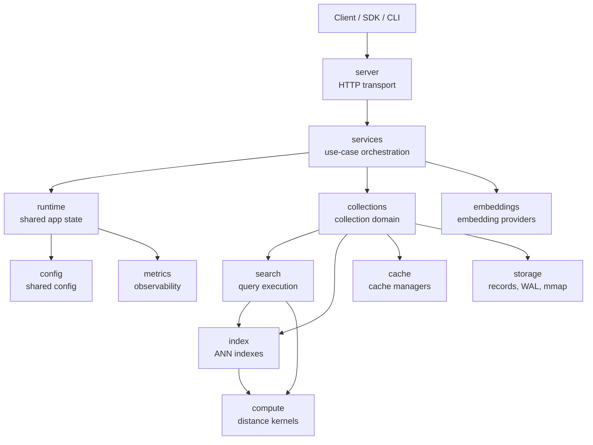
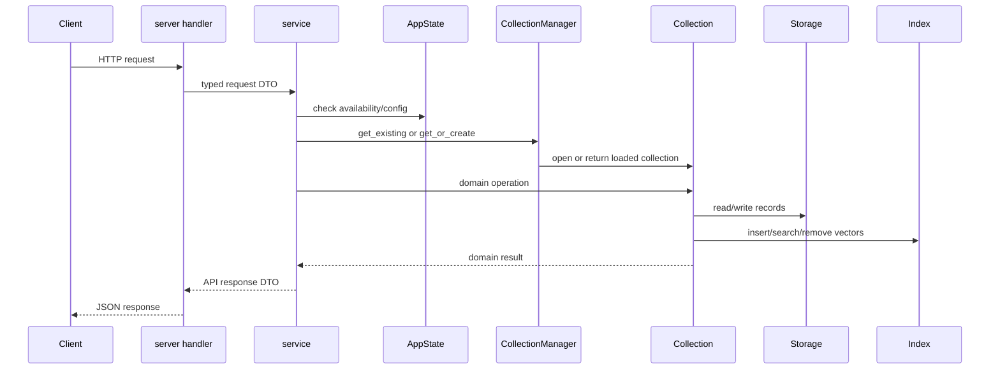
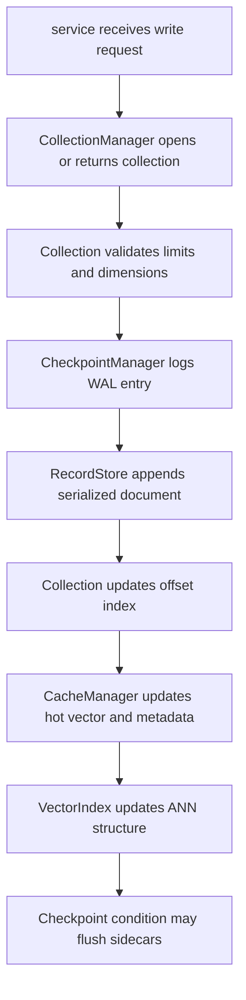
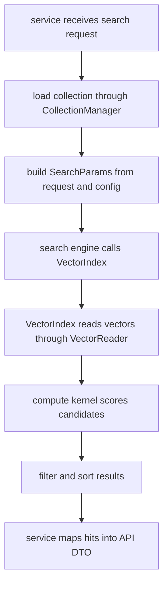
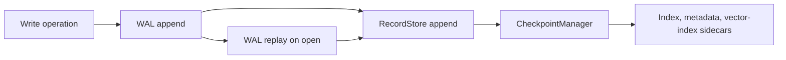
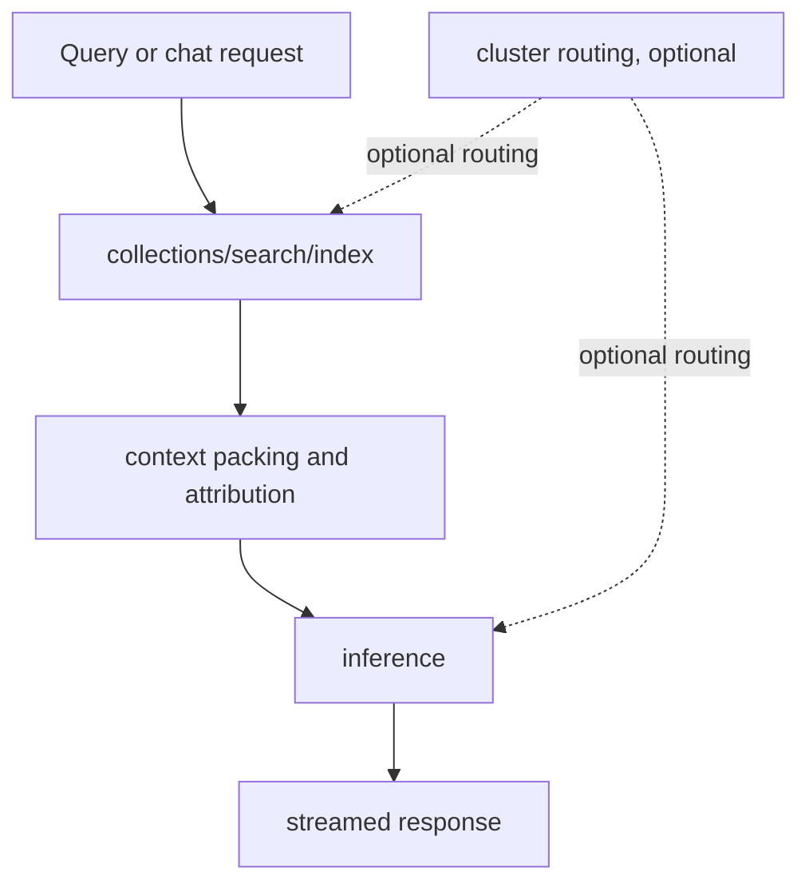

# Architecture Guide

This guide explains how the Piramid codebase is organized and how the main runtime paths fit together.

## Big Picture

The current system is centered around vector storage, retrieval, metadata filtering, embedding ingestion, durability, and HTTP APIs. The longer-term direction is to make the same database memory usable by local inference and small trusted clusters without turning the server into a pile of unrelated subsystems.

The first diagram is a dependency view. Arrows mean "uses" or "calls into"; they do not mean the lower box should be nested inside the upper folder.

For example, `runtime/` uses `config/` and `metrics/`, but those modules are not owned by `runtime/`. They stay top-level because config and observability are shared by multiple layers.

The folder ownership view is different. At the crate level, most folders are peers with clear responsibilities:

```mermaid
flowchart TD
    Src[src/]

    Src --> Bin[src/bin/piramid.rs<br/>binary entrypoint]
    Src --> Cli[cli/<br/>CLI commands]
    Src --> Server[server/<br/>HTTP transport]
    Src --> Services[services/<br/>use cases]
    Src --> Runtime[runtime/<br/>app state]
    Src --> Collections[collections/<br/>domain layer]
    Src --> Storage[storage/<br/>persistence primitives]
    Src --> Search[search/<br/>query execution]
    Src --> Index[index/<br/>ANN indexes]
    Src --> Compute[compute/<br/>distance kernels]
    Src --> Cache[cache/<br/>cache policy]
    Src --> Embeddings[embeddings/<br/>embedding providers]
    Src --> Metrics[metrics/<br/>observability]
    Src --> Config[config/<br/>shared configuration]
    Src --> Quantization[quantization/<br/>precision and compression]
    Src --> Inference[inference/<br/>future local inference]
    Src --> Cluster[cluster/<br/>future distributed systems]
    Src --> Error[error/<br/>error categories]
    Src --> Metadata[metadata.rs<br/>metadata values]
    Src --> Validation[validation.rs<br/>input validation]

    Collections --> CollectionOps[collections/operations/<br/>read, write, metadata, limits]
    Storage --> Wal[storage/wal/<br/>write-ahead log]
    Storage --> Persistence[storage/persistence/<br/>sidecar and mmap helpers]
    Server --> Types[server/types/<br/>API DTOs]
    Server --> Handlers[server/handlers/<br/>HTTP handlers]
```

Top-level folders should not be collapsed just because one layer depends on another. Move code based on ownership, not only on call direction.

## Directory Map

### `server/`

HTTP transport. This is where routes, handlers, request helpers, request IDs, and API DTOs live.

Handlers should stay thin: parse request data, call a service, and serialize the response. They should not mutate collections, plan searches, manage WAL, or own cache/index logic.

### `services/`

Application orchestration. This layer coordinates user-facing operations: collection lifecycle, vector writes, search, embedding requests, admin views, health checks, and readiness checks.

Services know about runtime state and domain objects. They should not know about low-level file formats or mmap implementation details.

### `runtime/`

Shared application state. `AppState` holds the active config, shutdown/read-only flags, optional embedder, rebuild job tracking, cache-budget enforcement, and the `CollectionManager`.

This layer is server-wide. Anything that belongs to one collection should usually live in `collections/`.

### `collections/`

Collection domain logic. This is where the `Collection` object and collection-level behavior live.

Important pieces:

- `collection.rs` defines the collection domain object.
- `manager.rs` defines `CollectionManager`, which opens and tracks loaded collections.
- `operations/` contains read, write, metadata, and limit enforcement internals.
- `checkpoint.rs` defines `CheckpointManager`, which owns WAL/checkpoint bookkeeping at the collection level.
- `compact.rs` rewrites live records into a compacted store.
- `dup.rs` handles duplicate-vector detection.
- `search.rs` adapts collection settings into search execution.

This layer is allowed to orchestrate storage, index, cache, and search together because a collection is the unit where those systems meet.

### `storage/`

Low-level persistence. This layer owns:

- `RecordStore`
- document serialization boundaries
- collection metadata sidecars
- WAL files and WAL entries
- mmap and file-growth helpers
- index and vector-index persistence helpers

Storage should not decide API behavior, search semantics, or collection lifecycle policy. It should provide safe persistence primitives for the domain layer to use.

### `index/`

Vector index implementations and index abstractions.

Current index families:

- Flat
- HNSW
- IVF

The key interfaces are `VectorIndex` and `VectorReader`. Index implementations should focus on traversal, index-specific settings, and index stats. They should not own collection storage or HTTP behavior.

### `compute/`

Distance and similarity kernels. This includes cosine, dot product, and Euclidean distance, with scalar, SIMD, parallel, binary, and JIT-style variants where available.

This layer is separate because distance math is shared by indexes, search, clustering, quantization experiments, and future GPU backends.

### `cache/`

Cache state and cache policy. `CacheManager` currently manages vector and metadata caches and implements `VectorReader` for index/search paths.

This boundary is also the future home for cache budgeting, eviction policy, query-result caches, embedding-cache coordination, and KV-cache accounting.

### `search/`

Query execution. Search handles filter evaluation, score calculation, sorting and truncation, batch search helpers, search request parameters, and query types.

Search can call indexes and compute kernels, but it should not own persistence or collection lifecycle behavior.

### `embeddings/`

Embedding providers and provider-level behavior. This includes provider selection, OpenAI/local/Ollama-style adapters, caching, retries, and embedding response types.

This is separate from `inference/` because embeddings are already a concrete ingestion feature, while local text generation is still a future boundary.

### `metrics/`

Observability. This layer tracks latency, lock timing, and embedding metrics. Distance math lives in `compute/`; telemetry and reporting live here.

### `config/`

Shared configuration. This covers app config, collection config, execution mode, memory settings, search settings, WAL settings, storage settings, limits, cache config, and quantization config.

### `quantization/`

Vector precision and compression logic. This stays independent because quantization can affect storage format, index traversal, reranking, export formats, and eventually inference memory.

### `inference/`

Scaffold boundary for future local inference. Model placement, local inference adapters, batching, streaming, KV-cache ownership, and OpenAI-compatible inference APIs should live here when they land.

### `cluster/`

Scaffold boundary for future distributed systems work. Membership, node capability discovery, shard ownership, replication, fan-out routing, and partial-result handling should live here when they land.

### Cross-cutting modules

Some modules are intentionally cross-cutting:

- `error/` defines error categories and conversion boundaries.
- `metadata.rs` defines metadata values and helpers.
- `validation.rs` defines input validation.
- `cli/` and `src/bin/piramid.rs` define the binary entrypoint and CLI commands.

These modules should stay small and boring. If a cross-cutting module starts owning domain behavior, move that behavior back into the correct layer.

## Request Flow

Most HTTP requests follow the same shape:

The main design goal is to keep conversion boundaries explicit:

- HTTP request/response conversion happens in `server/`.
- Operational decisions happen in `services/`.
- Collection mutation and search coordination happen in `collections/`.
- Bytes, files, WAL, and mmap details happen in `storage/`.

## Write Path

Vector writes go through the collection domain layer. At a high level, the source of truth is the record store plus persistence sidecars. The cache and vector index are acceleration structures that must remain rebuildable from stored records.

## Search Path

Search combines collection configuration, index traversal, compute kernels, and optional filtering. `VectorReader` is the important boundary here. Indexes should not require ownership of a collection's internal vector map. They should ask for vectors through the reader interface so the backing source can evolve from cache-backed reads to mmap-backed or quantized readers later.

## Durability and Recovery

Piramid uses WAL plus checkpoints. `CheckpointManager` owns collection-level checkpoint bookkeeping and WAL rotation. Low-level file serialization helpers remain in `storage/`. On open, the collection builder loads existing sidecars, opens the record store, initializes the WAL, and replays entries when needed. After replay, the collection can checkpoint to persist the recovered state.

## Manager Types

The codebase uses manager naming where a type owns lifecycle or policy for another subsystem:

- `CacheManager` owns cache state and cache policy.
- `CollectionManager` owns loaded collection handles and collection opening.
- `CheckpointManager` owns WAL/checkpoint bookkeeping for a collection.

## Future Boundaries

Two boundaries exist before full implementations: `inference/`, `cluster/`. These should stay empty or minimal until there is real code to move into them. When those systems land, they should integrate through services and runtime state rather than bypassing the existing layers.

Expected direction:

## Development Rules

When adding or moving code, use these rules first:

1. If it is HTTP-specific, put it in `server/`.
2. If it coordinates a user-facing operation, put it in `services/`.
3. If it changes one collection's domain state, put it in `collections/`.
4. If it reads/writes bytes, mmap, WAL, or sidecar files, put it in `storage/`.
5. If it is an ANN implementation detail, put it in `index/`.
6. If it is distance math or backend dispatch, put it in `compute/`.
7. If it is telemetry, put it in `metrics/`.
8. If it is cache ownership or eviction policy, put it in `cache/`.
9. If it is model execution, put it in `inference/`.
10. If it is distributed placement or routing, put it in `cluster/`.

If a change touches three or more layers, start with the service boundary and make the data flow explicit. That usually prevents storage, HTTP, and index code from getting tangled together.
